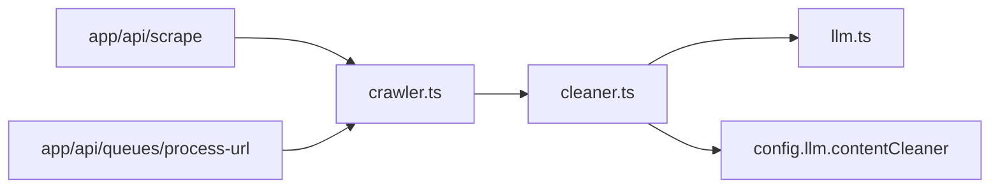

# lib/processors/cleaner.ts

## 職責契約

此模組負責將原始 Markdown 內容送入可相容 OpenAI Chat Completion 的 LLM，產出較適合知識庫/RAG 使用的清洗後 Markdown。它同時承擔兩個流程控制責任：一是為內容清洗提供預設提示詞與執行期覆蓋入口，二是在輸入為空或 LLM 失敗時採取 fail-soft 行為，避免上游流程因清洗階段中斷。

它**只做內容後處理**，**不負責**網址發現、頁面抓取、R2 儲存、任務狀態更新或任何佇列控制；它也**不自行實作規則式清理器**，而是把清理語意委派給 `lib/services/llm.ts`。

## 接口摘要

### `CleanerOverrides`

- **用途**：覆蓋預設 LLM 連線與提示詞設定。
- **欄位**：`model?`、`apiKey?`、`baseUrl?`、`prompt?`。

### `cleanContent(rawMarkdown, overrides?)`

- **Input**：`rawMarkdown: string`；`overrides?: CleanerOverrides`。
- **Output**：`Promise<string>`；正常時回傳清洗後 Markdown，若輸入為空或執行失敗則回傳空字串。
- **Side Effect**：記錄 console log；呼叫外部 LLM API。
- **Constraints**：
  - 預設模型/端點來自 `config.llm.contentCleaner`。
  - 預設 system prompt 內建於模組中，可被覆蓋。
  - 空內容會提早返回，避免把空 Markdown 送入 LLM。

## 依賴拓撲

- `app/api/queues/process-url/route.ts` → `scrapeUrl()`（`crawler.ts`）→ **`cleanContent()`** → `putObject()`
- `app/api/scrape/route.ts` → `scrapeUrlAdvanced()`（`crawler.ts`）→ **`cleanContent()`** → 可選 R2 儲存
- **`cleanContent()`** → `chatCompletion()`（`lib/services/llm.ts`）→ OpenAI 相容 LLM 端點
- **`cleanContent()`** → `config.llm.contentCleaner` 取得預設模型、API Key、Base URL

