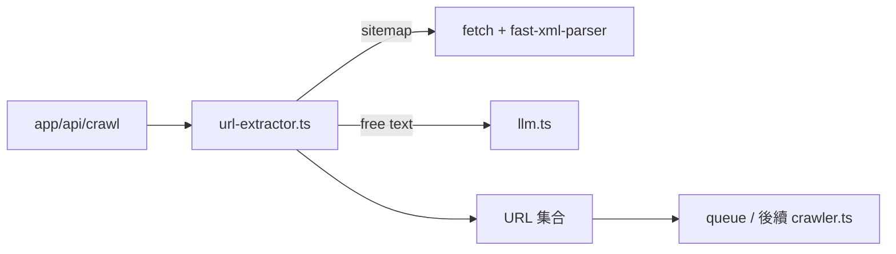

# lib/processors/url-extractor.ts

## 職責契約

此模組負責把使用者輸入轉換為可供後續抓取流程使用的 URL 陣列。它會先辨識輸入是「已成形 URL 清單」、「單一 sitemap URL」或「自由文字」，再分別採取直接去重、遞迴展開 sitemap、或委派 LLM 抽取三種策略。

它**不負責**排程任務、抓取頁面內容、儲存結果或驗證 URL 是否可抓取；它的目標是建立「待處理網址集合」，而不是執行實際 crawl/scrape。

## 接口摘要

### `UrlExtractorOverrides`

- **用途**：覆蓋 URL 抽取所使用的 LLM 設定與 prompt。
- **欄位**：`apiKey?`、`baseUrl?`、`model?`、`prompt?`。

### `extractUrls(input, overrides?)`

- **Input**：`input: string`；`overrides?: UrlExtractorOverrides`。
- **Output**：`Promise<string[]>`；回傳去重後的 URL 陣列。
- **Side Effect**：可能發出 sitemap `fetch`；可能呼叫外部 LLM API；記錄 console log。
- **Constraints**：
  - 若輸入按換行/逗號切開後全部符合 URL 正規式，會走規則式路徑而非 LLM。
  - 單一 sitemap 連結會遞迴展開子 sitemap / `<loc>` 條目。
  - 非 URL 格式文字才會透過 `chatCompletion()` 要求輸出 JSON 形式的 `urls` 陣列。

## 依賴拓撲

- `app/api/crawl/route.ts` → **`extractUrls()`** → 產生 queue 任務所需 URL 清單
- **`extractUrls()`** → 規則判斷：直接 URL 清單 / sitemap / 自由文字
- sitemap 路徑：**`extractUrls()`** → `fetch(sitemap)` → `fast-xml-parser` → 遞迴展開 URL
- 自由文字路徑：**`extractUrls()`** → `chatCompletion()`（`lib/services/llm.ts`）→ JSON URL 陣列
- 在 bundle 內部，**`url-extractor.ts` 位於 `crawler.ts` 之前**：它先決定要抓哪些網址，後續頁面內容才由 `crawler.ts` 取得；它與 `cleaner.ts` 共用 `llm.ts` 作為 LLM 基礎層。

