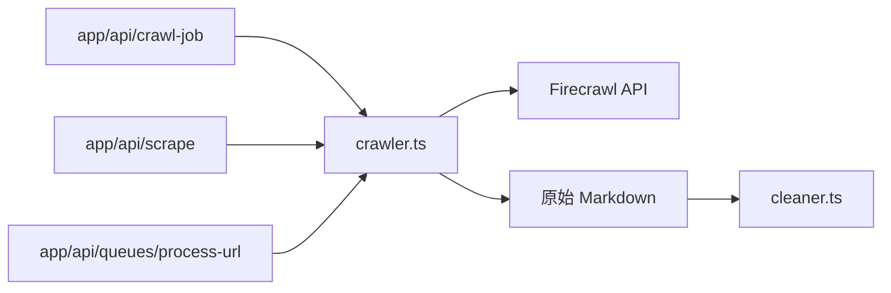

# lib/services/crawler.ts

## 職責契約

此模組是 Firecrawl 的服務封裝層，負責建立/重用客戶端實例，並對外提供三類能力：單頁 scrape、進階單頁 scrape、非同步 crawl job 的啟動與狀態查詢。它將外部 Firecrawl SDK 轉換為專案內部較穩定的函式接口，並統一錯誤語意與預設設定來源。

它**不負責**LLM 清洗、URL 抽取、R2 儲存、任務狀態持久化或 UI/HTTP 請求解析；它的產出是「原始抓取結果或遠端 job 狀態」，而不是最終可保存內容。

## 接口摘要

### `CrawlerOverrides`

- **用途**：覆蓋 Firecrawl 連線資訊。
- **欄位**：`apiKey?`、`apiUrl?`。

### `ScrapeAdvancedOptions`

- **用途**：控制進階單頁抓取行為。
- **欄位**：`waitFor?`、`timeout?`、`onlyMainContent?`、`mobile?`、`includeTags?`、`excludeTags?`。

### `ScrapeAdvancedResult`

- **Output Shape**：`markdown: string`；`metadata?: Record<string, unknown>`。

### `scrapeUrl(url, overrides?)`

- **Input**：`url: string`；`overrides?: CrawlerOverrides`。
- **Output**：`Promise<string>`；回傳原始 Markdown。
- **Side Effect**：呼叫 Firecrawl `scrapeUrl`；記錄 console log。
- **Constraints**：固定請求 `markdown` 格式，並帶 60 秒 timeout。

### `scrapeUrlAdvanced(url, options?, overrides?)`

- **Input**：`url: string`；`options?: ScrapeAdvancedOptions`；`overrides?: CrawlerOverrides`。
- **Output**：`Promise<ScrapeAdvancedResult>`；包含 Markdown 與可選 metadata。
- **Side Effect**：呼叫 Firecrawl `scrapeUrl`；記錄 console log。
- **Constraints**：只序列化有提供的進階參數，避免把未定義欄位送往外部 API。

### `startCrawlJob(url, limit = 100, overrides?)`

- **Input**：目標站點 URL、網址上限、可選 Firecrawl 覆蓋設定。
- **Output**：`Promise<string>`；回傳 Firecrawl job ID。
- **Side Effect**：呼叫 Firecrawl `asyncCrawlUrl`。
- **Constraints**：crawl job 只要求 `links` 格式，代表此路徑服務於「找連結」而非直接取得正文。

### `checkCrawlJob(jobId, overrides?)`

- **Input**：`jobId: string`；`overrides?: CrawlerOverrides`。
- **Output**：Firecrawl 狀態回應物件。
- **Side Effect**：呼叫 Firecrawl `checkCrawlStatus`。

## 依賴拓撲

- `app/api/queues/process-url/route.ts` → **`scrapeUrl()`** → 原始 Markdown → `cleaner.ts` → R2
- `app/api/scrape/route.ts` → **`scrapeUrlAdvanced()`** → 原始 Markdown / metadata → 可選 `cleaner.ts` → 可選 R2
- `app/api/crawl-job/route.ts` → **`startCrawlJob()` / `checkCrawlJob()`** → Firecrawl 非同步 crawl API
- **`crawler.ts`** → `config.firecrawl` 取得預設 API Key / API URL
- 在 bundle 內部，**`crawler.ts` 是 `cleaner.ts` 的上游資料來源**；`llm.ts` 不參與抓取本身，但會在抓取完成後被 `cleaner.ts` 接手。

