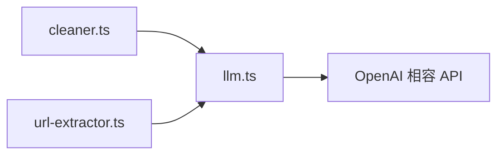

# lib/services/llm.ts

## 職責契約

此模組提供最薄的一層 OpenAI 相容 Chat Completion 呼叫能力，負責組裝 payload、正規化 endpoint、附帶授權標頭、處理重試退避，以及把回應收斂為單純字串內容。它是 bundle 內所有 LLM 依賴的共同基礎設施。

它**不負責**決定 prompt 策略、內容清洗規則、URL 抽取語意、任務編排或結果持久化；它只保證「把訊息送到相容端點，並把第一個 completion 的文字內容拿回來」。

## 接口摘要

### `LLMConfig`

- **欄位**：`baseUrl`、`apiKey`、`model`。
- **用途**：描述單次 chat completion 的連線與模型配置。

### `ChatMessage`

- **欄位**：`role`（`system | user | assistant`）、`content`。
- **用途**：描述對話訊息形狀。

### `ChatOptions`

- **欄位**：`responseFormat?`、`temperature?`。
- **用途**：控制是否要求 JSON 物件輸出及採樣溫度。

### `chatCompletion(configParams, messages, options?)`

- **Input**：
  - `configParams`: `{ baseUrl: string; apiKey: string; model: string }`
  - `messages`: OpenAI 相容訊息陣列
  - `options?`: `responseFormat`、`temperature`
- **Output**：`Promise<string>`；回傳第一個 choice 的 `message.content`。
- **Side Effect**：對外發送 HTTP POST；記錄 request / retry log；在失敗時做指數退避等待。
- **Constraints**：
  - 最多重試 3 次。
  - 若 `baseUrl` 未以 `/chat/completions` 結尾，會自動補齊。
  - `responseFormat === 'json_object'` 時會在 payload 中注入 `response_format`。

## 依賴拓撲

- `lib/processors/cleaner.ts` → **`chatCompletion()`** → 內容清洗 LLM
- `lib/processors/url-extractor.ts` → **`chatCompletion()`** → URL 抽取 LLM
- API routes **不直接依賴此模組**；它位於 bundle 最底層，作為 processor 層的共用外部通訊適配器。

