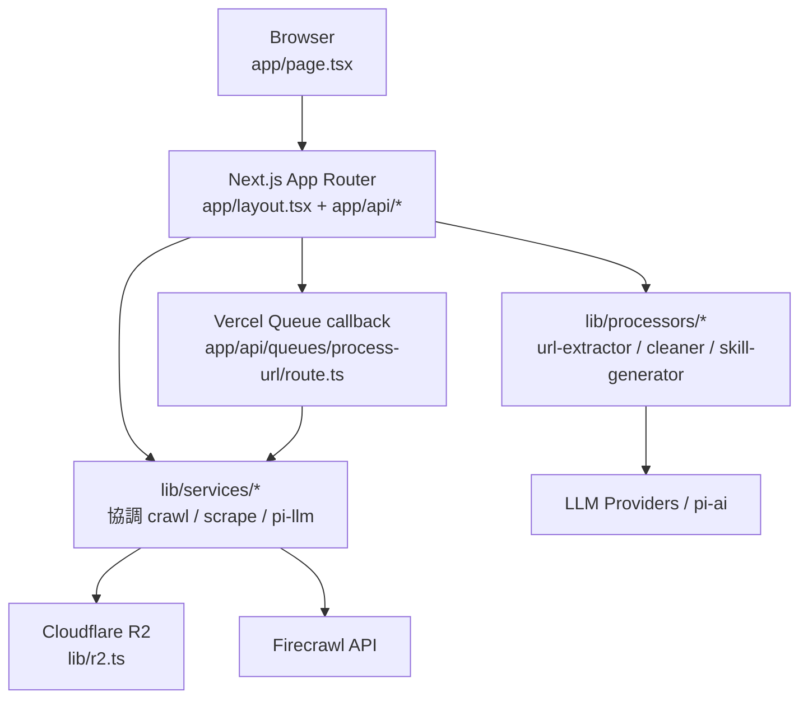

# 專案總覽與唯一子專案邊界

## 本頁範圍與讀者定位
本頁只回答三件事：這個 repo 目前唯一已證實的執行單元是什麼、`app/`/`lib/`/`tests/` 在這個單元裡各自負責什麼，以及 crawl、scrape、skill generation 為何都屬於同一個 Next.js 應用而不是多個獨立子專案。從根目錄啟動腳本、Next 設定與 App Router 入口來看，這個系統的主體就是 repo root 的 Next.js App：`package.json` 直接用 `next dev/build/start` 啟動，`next.config.ts` 只配置這個 runtime，而 `app/layout.tsx` 與 `app/page.tsx` 則分別提供全域外殼與單頁主控台入口。 Sources: [package.json](../../../package.json#L5-L32), [next.config.ts](../../../next.config.ts#L1-L11), [app/layout.tsx](../../../app/layout.tsx#L15-L33), [app/page.tsx](../../../app/page.tsx#L92-L95)

## 唯一已證實的執行單元
目前能直接從 build、部署與模組解析檔案驗證到的邊界，都只指向同一個 TypeScript/Next.js workspace：`tsconfig.json` 把 `@/*` 指到 repo root，Dockerfile 直接在根目錄 `npm ci`、`npm run build`、`npm start`，`docker-compose.yml` 只啟動一個 `crawldocs` 服務，而 `vercel.json` 也是對同一棵 `app/api/*` route tree 設定 function timeout 與 queue trigger。因此，這個 repo 的合理邊界不是「多個可獨立部署的 app」，而是「一個 Next.js 應用內含多個能力區」。 Sources: [tsconfig.json](../../../tsconfig.json#L2-L34), [Dockerfile](../../../Dockerfile#L1-L26), [docker-compose.yml](../../../docker-compose.yml#L3-L18), [vercel.json](../../../vercel.json#L1-L37)

## 架構總覽

這張圖反映的是「單一應用內部分層」而不是「多服務拓樸」：瀏覽器端的 Create、Tasks、Skill 都由同一個 `app/page.tsx` 呈現，真正的 server-side 能力則由 `app/api/*` route 進入，再共同落到 `lib/services`、`lib/processors` 與 `lib/r2.ts`；只有 batch crawl 在符合條件時會多經過 Vercel Queue callback，但 callback 最後仍回到同一份 `crawl-dispatch` 邏輯。 Sources: [app/page.tsx](../../../app/page.tsx#L93-L95), [app/page.tsx](../../../app/page.tsx#L1119-L1174), [app/page.tsx](../../../app/page.tsx#L1791-L1795), [app/page.tsx](../../../app/page.tsx#L2710-L2714), [app/api/crawl/route.ts](../../../app/api/crawl/route.ts#L10-L98), [app/api/scrape/route.ts](../../../app/api/scrape/route.ts#L8-L46), [app/api/generate-skill/route.ts](../../../app/api/generate-skill/route.ts#L166-L238), [app/api/queues/process-url/route.ts](../../../app/api/queues/process-url/route.ts#L1-L14), [lib/services/crawl-dispatch.ts](../../../lib/services/crawl-dispatch.ts#L78-L114)

## 關鍵模組 / 邊界表

| 區域 | 主要責任 | 代表檔案 | 邊界意義 |
|---|---|---|---|
| Root runtime | 啟動、建置、部署設定 | `package.json`, `next.config.ts`, `Dockerfile`, `vercel.json` | 定義唯一可執行 app 的 build / start / deploy 方式 |
| `app/` | 單頁控制台與 App Router API routes | `app/page.tsx`, `app/layout.tsx`, `app/api/*` | 使用者入口與 HTTP 邊界都在同一個 Next.js 專案內 |
| `lib/services/` | 外部呼叫與任務協調 | `crawl-dispatch.ts`, `crawler.ts`, `scrape-task.ts`, `pi-llm.ts` | 是應用內服務層，不是獨立微服務 |
| `lib/processors/` | 內容轉換與生成流程 | `url-extractor.ts`, `cleaner.ts`, `skill-generator.ts` | 封裝 crawl 後處理與 skill 生成管線 |
| `lib/r2.ts` + 查詢 API | 共用持久化與狀態查詢 | `lib/r2.ts`, `/api/tasks`, `/api/files` | 任務、檔案與 cleaned/skill 資料共用同一個儲存背板 |
| `tests/` | 核心回歸保護 | `crawl-dispatch.test.ts`, `scrape-task.test.ts`, `task-metadata.test.ts` | 驗證重要協調邏輯，但不是另一個執行單元 |

這個表的重點不是目錄名稱，而是責任切分：`app/` 是入口層，`lib/` 是被多個 route 共用的應用層與處理層，`tests/` 則專注於保護 queue fallback、單頁 scrape 任務與 task metadata 規則；它們都服務於同一個 root app，而不是各自獨立建置與部署。 Sources: [package.json](../../../package.json#L5-L32), [app/page.tsx](../../../app/page.tsx#L92-L95), [app/api/crawl/route.ts](../../../app/api/crawl/route.ts#L1-L108), [lib/services/crawl-dispatch.ts](../../../lib/services/crawl-dispatch.ts#L1-L114), [lib/services/scrape-task.ts](../../../lib/services/scrape-task.ts#L155-L240), [lib/processors/skill-generator.ts](../../../lib/processors/skill-generator.ts#L142-L265), [lib/r2.ts](../../../lib/r2.ts#L89-L157), [tests/crawl-dispatch.test.ts](../../../tests/crawl-dispatch.test.ts#L22-L81), [tests/scrape-task.test.ts](../../../tests/scrape-task.test.ts#L6-L156), [tests/task-metadata.test.ts](../../../tests/task-metadata.test.ts#L13-L120)

## 同一個控制台承接多能力，而不是多前端
前端使用者其實只面對一個控制台：狀態樹最上層的 `activeTab` 只有 `tasks`、`create`、`skill`、`storage`、`settings` 五種，而 `create` 內再切成 `scrape`、`crawl`、`map` 三種 source mode。這代表 Scrape、Crawl、Map、Task history 與 Skill Generator 在產品邊界上是同一個 UI，而不是拆成多個獨立站點或多個前端子專案。 Sources: [app/page.tsx](../../../app/page.tsx#L93-L95), [app/page.tsx](../../../app/page.tsx#L1119-L1174), [app/page.tsx](../../../app/page.tsx#L1791-L1795), [app/page.tsx](../../../app/page.tsx#L2710-L2729)

## 核心流程 1：Crawl 探索與批次處理屬於同一任務系統
`handleCrawl()` 並不是直接開另一條後端管線，而是先呼叫 `/api/crawl-job` 讓 Firecrawl 做網站探索、輪詢拿回 links，再把結果回灌到 `handleSubmit()`；真正建立任務的是 `/api/crawl`，它會先用 `extractUrls()` 解析輸入、建立 `tasks/{taskId}.json`、再交給 `dispatchCrawlJobs()` 決定走 queue、inline 或 mixed。這表示 crawl exploration 只是 batch task 的前置步驟，沒有形成第二個獨立子系統。 Sources: [app/page.tsx](../../../app/page.tsx#L566-L606), [app/page.tsx](../../../app/page.tsx#L760-L826), [app/api/crawl-job/route.ts](../../../app/api/crawl-job/route.ts#L4-L67), [app/api/crawl/route.ts](../../../app/api/crawl/route.ts#L21-L98), [lib/processors/url-extractor.ts](../../../lib/processors/url-extractor.ts#L23-L50), [lib/services/crawl-dispatch.ts](../../../lib/services/crawl-dispatch.ts#L78-L114)

批次任務一旦進入執行階段，queue callback 也沒有自成另一個服務：`app/api/queues/process-url/route.ts` 只是把 `CrawlJobPayload` 交回 `processCrawlJob()`；而 `crawl-dispatch.ts` 在處理 URL 時同時負責抓 Firecrawl、清洗內容、寫入 raw/cleaned 檔、更新 task 狀態與 retry 記錄。換句話說，queue 只是 delivery mechanism，核心業務邏輯仍在同一個 `lib/services/crawl-dispatch.ts` 裡。 Sources: [app/api/queues/process-url/route.ts](../../../app/api/queues/process-url/route.ts#L1-L14), [lib/services/crawl-dispatch.ts](../../../lib/services/crawl-dispatch.ts#L165-L327)

## 核心流程 2：單頁 Scrape 是同一任務模型的單 URL 變體
單頁模式下，`handleScrape()` 對單一 URL 呼叫 `/api/scrape`，後端則透過 `runSingleScrapeTask()` 先寫入 `processing` 任務，再在成功時更新為 `completed`、失敗時更新為 `failed`，同時可選擇進行 LLM 清理與把 raw/cleaned 檔寫進 R2。前端拿到結果後，一面更新 `taskId`/`taskStatus`，一面保留即時預覽，因此 single scrape 不是旁支工具，而是共用 `JobTask` 模型與 R2 存放規則的單筆任務型態。 Sources: [app/page.tsx](../../../app/page.tsx#L676-L756), [app/api/scrape/route.ts](../../../app/api/scrape/route.ts#L8-L46), [lib/services/scrape-task.ts](../../../lib/services/scrape-task.ts#L135-L240), [lib/processors/cleaner.ts](../../../lib/processors/cleaner.ts#L55-L87), [lib/services/crawler.ts](../../../lib/services/crawler.ts#L74-L108)

## 核心流程 3：Skill Generator 也是同一應用內的功能面
Skill Generator 沒有獨立 server；它是同一個 `app/page.tsx` 裡的另一個 tab。前端會先透過 `/api/pi-models` 載入 provider/model registry、透過 `/api/codex-auth` 檢查 OAuth 狀態、再用 `/api/list-cleaned-folders` 挑選 `cleaned/{date}/{domain}` 的資料來源，最後送到 `/api/generate-skill` 建立 `skill-tasks/{taskId}.json` 並啟動背景處理。 Sources: [app/page.tsx](../../../app/page.tsx#L1791-L1858), [app/page.tsx](../../../app/page.tsx#L2029-L2044), [app/api/pi-models/route.ts](../../../app/api/pi-models/route.ts#L23-L85), [app/api/codex-auth/route.ts](../../../app/api/codex-auth/route.ts#L1-L16), [app/api/list-cleaned-folders/route.ts](../../../app/api/list-cleaned-folders/route.ts#L54-L79), [app/api/generate-skill/route.ts](../../../app/api/generate-skill/route.ts#L166-L238)

生成核心同樣位於應用內部：`generateSkill()` 先從 R2 讀 `cleaned/{date}/{domain}/` 的 Markdown，然後固定走 `summarize → generate → refine` 三段式流程；每一段都經過 `piComplete()`，而 `piComplete()` 再統一處理 provider 選擇、custom base URL 與 `openai-codex` 的 OAuth token 解析。這代表 Skill Generator 的本質是同一個 Next.js app 內的功能模組，而不是額外接了一個獨立 agent service。 Sources: [lib/processors/skill-generator.ts](../../../lib/processors/skill-generator.ts#L145-L265), [lib/services/pi-llm.ts](../../../lib/services/pi-llm.ts#L18-L141), [lib/oauth/pi-auth.ts](../../../lib/oauth/pi-auth.ts#L54-L98), [app/api/generate-skill/route.ts](../../../app/api/generate-skill/route.ts#L81-L159)

## 共用底層：設定、R2 與查詢面
跨所有能力的真正共用底層只有兩個：`lib/config.ts` 與 `lib/r2.ts`。前者集中列出 Firecrawl、URL Extractor、Content Cleaner、Skill Generator、R2 與 project limits 的設定 key；後者則延遲建立 R2 client，並提供 `putObject`、`getObject`、`listObjects`、`putTaskStatus`、`getTaskStatus`。在此之上，`/api/tasks`、`/api/files`、`/api/list-cleaned-folders` 都只是查詢同一份儲存背板的薄封裝。 Sources: [lib/config.ts](../../../lib/config.ts#L1-L36), [lib/r2.ts](../../../lib/r2.ts#L32-L157), [app/api/tasks/route.ts](../../../app/api/tasks/route.ts#L22-L87), [app/api/files/route.ts](../../../app/api/files/route.ts#L5-L64), [app/api/list-cleaned-folders/route.ts](../../../app/api/list-cleaned-folders/route.ts#L54-L79)

## 測試目前覆蓋到的邊界
現有測試沒有把 repo 切成多個可測套件，而是直接驗證同一應用內最容易回歸的協調規則：`crawl-dispatch.test.ts` 驗證 queue 不可用時的 inline / mixed fallback，`scrape-task.test.ts` 驗證單頁 scrape 會依序寫入 processing 與 completed/failed 任務，`task-metadata.test.ts` 則保護日期格式、domain summary 與敏感設定清洗規則。這些測試再次說明目前的工程切面是「一個 app 的多模組」，不是「多個各自測試的子專案」。 Sources: [tests/crawl-dispatch.test.ts](../../../tests/crawl-dispatch.test.ts#L22-L81), [tests/scrape-task.test.ts](../../../tests/scrape-task.test.ts#L6-L156), [tests/task-metadata.test.ts](../../../tests/task-metadata.test.ts#L13-L120)

## 目前仍應保留的邊界說明
依本頁實際可引用的啟動檔、部署檔與 route/service 程式碼，我可以明確把這個 repo 視為單一 Next.js 應用，並把 crawl、scrape、tasks、files、skill generation 視為其內部能力區；但本頁不會進一步臆測任何未被這些 root-controlled 入口直接證實的額外 deployable runtime。換句話說，這份文件描述的是「目前有程式碼證據支撐的唯一子專案邊界」。 Sources: [package.json](../../../package.json#L5-L32), [next.config.ts](../../../next.config.ts#L1-L11), [Dockerfile](../../../Dockerfile#L1-L26), [docker-compose.yml](../../../docker-compose.yml#L3-L18), [vercel.json](../../../vercel.json#L1-L37)
