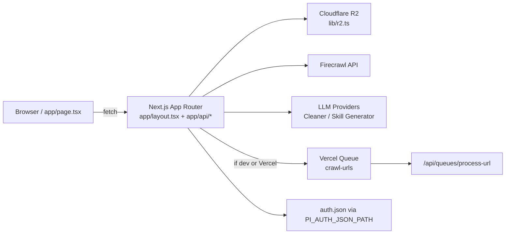

# 執行環境、部署方式與設定來源

## 本頁範圍與讀者定位
本頁只回答三件事：這個專案如何被啟動、有哪些可驗證的部署模式，以及 runtime 設定究竟來自哪裡。從程式碼可見它是單一 Next.js 16 / React 19 應用，前端控制台入口在 `app/page.tsx`，全域外殼在 `app/layout.tsx`，後端能力則以 App Router API routes 形式放在 `app/api/*`。 Sources: [package.json](../../../package.json#L5-L32), [app/layout.tsx](../../../app/layout.tsx#L1-L33), [app/page.tsx](../../../app/page.tsx#L1-L31)

## 執行拓樸總覽

瀏覽器端單頁控制台會呼叫 `/api/crawl`、`/api/scrape`、`/api/generate-skill` 等 API；伺服器端再把資料送往 R2、Firecrawl 與 LLM，只有 crawl URL 批次處理在符合條件時會交給 Vercel Queue，否則改走 inline fallback。 Sources: [app/page.tsx](../../../app/page.tsx#L675-L746), [app/api/crawl/route.ts](../../../app/api/crawl/route.ts#L10-L98), [lib/services/crawl-dispatch.ts](../../../lib/services/crawl-dispatch.ts#L62-L113), [lib/r2.ts](../../../lib/r2.ts#L35-L57), [lib/oauth/pi-auth.ts](../../../lib/oauth/pi-auth.ts#L71-L98)

## 部署模式與啟動方式

| 模式 | 啟動方式 | 主要設定來源 | 目前可驗證觀察 |
|---|---|---|---|
| 本地開發 | `npm run dev` → `next dev` | 本機環境變數、瀏覽器 localStorage、前端 request body | 適合直接操作單頁控制台與 App Router API。 |
| 一般正式 Node 啟動 | `npm run build` → `npm start` | 伺服器環境變數與程式內 fallback | 程式碼明確展示的是 build 後以 `next start` 啟動。 |
| Docker 自架 | `docker build` / `docker-compose up -d` | `Dockerfile` 的 ENV、`docker-compose.yml` 的 `.env` 與 volume 掛載 | 容器固定使用 `node:20-alpine`，並把 `auth.json` 掛到 `/app/auth-data/auth.json`。 |
| Vercel | 由 `vercel.json` 控制 functions 與 queue triggers | Vercel 環境變數、`vercel.json` 的 `maxDuration` / queue topic | 已定義 `crawl-urls` topic 與多個函式 timeout，skill 相關設定另見本文最後的驗證缺口。 |

上表反映的不是「理想部署矩陣」，而是程式碼已明確宣告的四種啟動/部署面：`package.json` 負責 dev/build/start，Dockerfile 負責容器 build 與執行，docker-compose 再補 `.env` 與 volume 掛載，而 Vercel 相關的執行時限制與 queue 觸發則集中在 `vercel.json`。 Sources: [package.json](../../../package.json#L5-L10), [Dockerfile](../../../Dockerfile#L1-L26), [docker-compose.yml](../../../docker-compose.yml#L1-L18), [vercel.json](../../../vercel.json#L1-L37)

## 設定來源分層
在本頁直接驗證到的路徑裡，多數 runtime 設定遵循「request body 覆蓋 > `lib/config.ts` 的 env 值 > 程式內 fallback 預設」：例如 `/api/crawl` 先讀前端送進來的 `engineSettings`，超過上限才回退到 `config.project.maxUrlsLimit`；`/api/generate-skill` 先用 body 的 provider/model/baseUrl/apiKey，再回退到 `config.llm.skillGenerator`；R2 也是先用 request override，沒有時才用預設 env client。 Sources: [app/api/crawl/route.ts](../../../app/api/crawl/route.ts#L21-L40), [app/api/generate-skill/route.ts](../../../app/api/generate-skill/route.ts#L81-L107), [lib/config.ts](../../../lib/config.ts#L1-L36), [lib/r2.ts](../../../lib/r2.ts#L58-L87)

| 來源層 | 內容 | 代表欄位 / 行為 |
|---|---|---|
| 程式內預設值 | 沒有外部設定時的預設 URL、model、bucket 與限制 | `FIRECRAWL_API_URL` fallback、`deepseek-chat`、`glm-4-flash`、`gpt-4o`、`crawldocs`、`MAX_URLS_LIMIT=1000`、`RETRY_ATTEMPTS=3` |
| 伺服器環境變數 | 後端共享設定主來源 | `FIRECRAWL_*`、`URL_EXTRACTOR_*`、`CONTENT_CLEANER_*`、`SKILL_GENERATOR_*`、`PI_AUTH_JSON_PATH`、`R2_*` |
| 掛載檔案 | OAuth 憑證不走 env，而是 JSON 檔 | `PI_AUTH_JSON_PATH` 指向 `auth.json`，Docker/前端文案都要求掛載它 |
| 瀏覽器 localStorage | 控制台重開後保留使用者輸入設定 | `docengineConfig` 保存清洗、URL Extractor、R2、Skill Generator 等欄位 |
| API request body | 每次執行可暫時覆蓋後端設定 | `/api/crawl` 的 `engineSettings`、`/api/scrape` 的 scrape/R2 參數、`/api/tasks` 與 `/api/skill-tasks` 的 R2 override |

前端控制台在 mount 時會從 `localStorage['docengineConfig']` 還原大量設定，之後每次欄位變動又回存；真正發動 crawl 或 scrape 時，這些值會被整理成 request body 傳給後端，所以「瀏覽器儲存的操作設定」與「伺服器讀取的環境變數」是兩條並存的設定來源，而不是單向覆蓋關係。 Sources: [app/page.tsx](../../../app/page.tsx#L335-L374), [app/page.tsx](../../../app/page.tsx#L436-L470), [app/page.tsx](../../../app/page.tsx#L580-L606), [app/page.tsx](../../../app/page.tsx#L698-L721), [app/api/tasks/route.ts](../../../app/api/tasks/route.ts#L67-L81)

## Queue、inline fallback 與長任務配置
批次 crawl 的背景化不是無條件啟用：`dispatchCrawlJobs()` 只有在 `NODE_ENV === 'development'` 或 `VERCEL === '1'` 時才嘗試呼叫 `@vercel/queue.send()`；如果碰到 OIDC token、非 Vercel Function 環境、或 project root 偵測失敗等錯誤，剩餘 URL 會立即改成 inline 處理，因此同一批任務的 dispatch mode 可能是 `queue`、`inline` 或 `mixed`。 Sources: [lib/services/crawl-dispatch.ts](../../../lib/services/crawl-dispatch.ts#L56-L113)

平台層的 queue 綁定則在 `vercel.json`：`app/api/queues/process-url/route.ts` 被宣告為 `crawl-urls` topic 的 consumer，`maxDeliveries` 為 4、`retryAfterSeconds` 為 30、`maxConcurrency` 為 2，而實際 route 只做一件事——把 message 與 deliveryCount 交給 `processCrawlJob()`。 Sources: [vercel.json](../../../vercel.json#L6-L17), [app/api/queues/process-url/route.ts](../../../app/api/queues/process-url/route.ts#L1-L14)

長任務 timeout 也不是只靠單一地方控制：`vercel.json` 針對 `clean`、`crawl`、`generate-skill` 與 queue worker 統一設定 `maxDuration`，但 `app/api/clean/route.ts` 與 `app/api/test-llm/route.ts` 也各自在 route 檔內匯出 `maxDuration`，表示部署時限與本地 route 限制是混合配置。 Sources: [vercel.json](../../../vercel.json#L2-L35), [app/api/clean/route.ts](../../../app/api/clean/route.ts#L1-L8), [app/api/test-llm/route.ts](../../../app/api/test-llm/route.ts#L1-L5)

## 與部署直接相關的敏感設定處理
R2 client 不是在模組載入時就初始化，而是到真正需要存取時才建立；若環境裡缺少 `R2_ACCOUNT_ID`、`R2_ACCESS_KEY_ID` 或 `R2_SECRET_ACCESS_KEY`，`getDefaultClient()` 會直接丟錯。另一方面，任務紀錄在寫入時會先經過 `sanitizeEngineSettingsForStorage()`，把 Firecrawl key、LLM key、URL Extractor key 與 R2 憑證欄位排除掉，只留下可安全回放的非敏感設定。 Sources: [lib/r2.ts](../../../lib/r2.ts#L32-L52), [lib/utils/task-metadata.ts](../../../lib/utils/task-metadata.ts#L27-L30), [lib/utils/task-metadata.ts](../../../lib/utils/task-metadata.ts#L125-L149)

Codex OAuth 採用的是「環境變數指定路徑 + 掛載 JSON 檔」模式：`lib/config.ts` 提供 `PI_AUTH_JSON_PATH`，`lib/oauth/pi-auth.ts` 再把相對路徑解析到 `process.cwd()` 下讀寫 `auth.json`，Dockerfile 與 docker-compose 也都把預設位置設為 `/app/auth-data/auth.json`；前端設定頁甚至直接提示部署者先在伺服器執行 `npx @mariozechner/pi-ai login openai-codex`，再把產生的 `auth.json` 掛進對應路徑。 Sources: [lib/config.ts](../../../lib/config.ts#L17-L24), [lib/oauth/pi-auth.ts](../../../lib/oauth/pi-auth.ts#L5-L15), [lib/oauth/pi-auth.ts](../../../lib/oauth/pi-auth.ts#L20-L31), [lib/oauth/pi-auth.ts](../../../lib/oauth/pi-auth.ts#L71-L98), [Dockerfile](../../../Dockerfile#L19-L26), [docker-compose.yml](../../../docker-compose.yml#L9-L17), [app/page.tsx](../../../app/page.tsx#L1835-L1850)

## 目前仍需保留的驗證缺口
`vercel.json` 已預留 `app/api/queues/process-skill/route.ts` 的 function/queue 設定，但本頁能直接從程式碼驗證到的 skill 任務實作，是 `/api/generate-skill` 在建立 `skill-tasks/{taskId}.json` 後，以 `processSkillGeneration(payload).catch(console.error)` 的 fire-and-forget 方式在當前 server runtime 內啟動處理；因此本頁只把 inline skill generation 視為已證實路徑，而把獨立 skill queue worker 視為尚待補證的部署缺口。 Sources: [vercel.json](../../../vercel.json#L18-L29), [app/api/generate-skill/route.ts](../../../app/api/generate-skill/route.ts#L78-L161), [app/api/generate-skill/route.ts](../../../app/api/generate-skill/route.ts#L166-L233)
