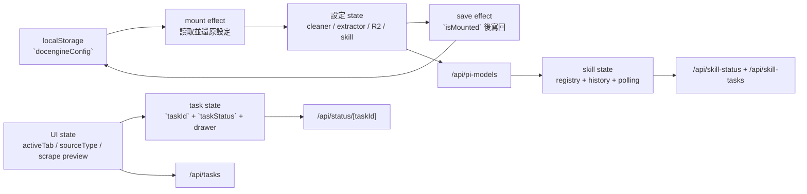

# 單頁主控台的狀態樹與本地設定還原

本頁只聚焦 `app/page.tsx` 這個單頁主控台如何把「分頁導覽、建立任務、即時監控、Skill Generator、Storage/Settings」收斂成同一棵 React state tree，以及哪些欄位會寫進 `localStorage`、哪些只存在於當前工作階段。`DocEngineFrontend` 是 client component，所有瀏覽器儲存與輪詢行為都從這裡出發。 Sources: [page.tsx](app/page.tsx#L1-L3), [page.tsx](app/page.tsx#L92-L218), [page.tsx](app/page.tsx#L1090-L1118)

## 狀態樹總覽

這個畫面的狀態不是單一「表單 state」，而是五組彼此相依的分支：`activeTab`/`sourceType` 控制畫面路由；Create 分頁持有 scrape/crawl/map 的輸入與進階參數；`taskId`/`taskStatus`/`drawerOpen` 管即時任務監控；`tasksList` 管歷史列表；Skill 分頁再額外維護 auth/provider/model/folder/history/polling；`isMounted` 只用來保護本地設定寫回時機。 Sources: [page.tsx](app/page.tsx#L93-L218), [page.tsx](app/page.tsx#L1097-L1113), [page.tsx](app/page.tsx#L1120-L1465), [page.tsx](app/page.tsx#L1791-L2084), [page.tsx](app/page.tsx#L2367-L2780)

圖上可以把它看成兩個回路：一個是 `docengineConfig -> mount restore -> state -> save effect -> docengineConfig` 的本地設定回路，另一個是 `taskId/skillTaskId -> polling/history API -> state` 的遠端同步回路；兩者都掛在同一個 client page，但只有前者會跨重新整理保留。 Sources: [page.tsx](app/page.tsx#L225-L282), [page.tsx](app/page.tsx#L335-L470), [page.tsx](app/page.tsx#L472-L556)

## 關鍵狀態群組 / 檔案導覽

| 狀態群組 | 代表 state | 主要用途 | 是否寫入 `docengineConfig` | 證據 |
| --- | --- | --- | --- | --- |
| 導航與建立模式 | `activeTab`, `sourceType`, `inputValue`, `mapUrl`, `crawlUrl` | 控制當前分頁、Create 子模式與輸入框內容 | 否 | [page.tsx](app/page.tsx#L93-L95), [page.tsx](app/page.tsx#L121-L153), [page.tsx](app/page.tsx#L1097-L1113), [page.tsx](app/page.tsx#L1124-L1455), [page.tsx](app/page.tsx#L439-L453) |
| 爬取/清洗/提取設定 | `depthLimit`, `maxConcurrency`, `maxUrls`, `maxRetries`, `urlTimeout`, `enableClean`, `firecrawlKey`, `llm*`, `urlExtractor*` | 組裝 `/api/crawl`、`/api/scrape`、LLM 測試與抽取設定 | 是 | [page.tsx](app/page.tsx#L97-L118), [page.tsx](app/page.tsx#L342-L356), [page.tsx](app/page.tsx#L439-L453), [page.tsx](app/page.tsx#L579-L600), [page.tsx](app/page.tsx#L699-L721) |
| R2 覆蓋設定 | `r2AccountId`, `r2AccessKeyId`, `r2SecretAccessKey`, `r2BucketName` | 讓前端在查詢/下載/寫入時覆蓋預設 R2 連線 | 是 | [page.tsx](app/page.tsx#L156-L159), [page.tsx](app/page.tsx#L357-L360), [page.tsx](app/page.tsx#L443-L454), [page.tsx](app/page.tsx#L2367-L2425) |
| 任務監控與歷史 | `taskId`, `taskStatus`, `drawerOpen`, `retryingUrls`, `abortingUrls`, `fileSizes`, `tasksList` | 承接目前任務、抽屜監看、下載/重試/終止與歷史列表 | 否 | [page.tsx](app/page.tsx#L161-L178), [page.tsx](app/page.tsx#L472-L556), [page.tsx](app/page.tsx#L2710-L3071), [page.tsx](app/page.tsx#L439-L453) |
| Skill Generator | `skillAuthMode`, `skillProvider`, `skillModel`, `skillApiKey`, `skillBaseUrl`, `skillUseCustomModel`, `skillCustomModelId`, `skillTaskId`, `skillStatus`, `skillHistory`, `selectedFolder` | 管理 provider/model 選擇、資料夾挑選、提交與輪詢 | 僅前七者會持久化；任務/歷史/資料夾選取不會 | [page.tsx](app/page.tsx#L180-L215), [page.tsx](app/page.tsx#L362-L369), [page.tsx](app/page.tsx#L445-L453), [page.tsx](app/page.tsx#L1791-L2084) |

前端本地的 `JobTask` 介面幾乎直接對齊後端 `lib/r2.ts` 的 `JobTask` JSON 結構，因此同一份資料既能拿來餵 `Task Progress Drawer`，也能拿來餵 `Tasks` 歷史列表與 `/api/status/[taskId]` 回傳值。 Sources: [page.tsx](app/page.tsx#L31-L46), [r2.ts](lib/r2.ts#L5-L22), [route.ts](app/api/status/[taskId]/route.ts#L9-L24), [route.ts](app/api/tasks/route.ts#L22-L54)

## 本地設定還原流程

初始化時，頁面先在 mount effect 內 `setIsMounted(true)`，再從 `localStorage.getItem('docengineConfig')` 取回 JSON，逐欄還原批次爬取參數、Cleaner/Extractor 設定、R2 覆蓋設定，以及 Skill Generator 的 auth/provider/model/baseUrl/custom model 旗標。因為元件本身是 `"use client"`，而 `localStorage` 讀取又放在 `useEffect` 內，這條還原鏈只會在瀏覽器端執行。 Sources: [page.tsx](app/page.tsx#L1-L3), [page.tsx](app/page.tsx#L335-L374)

寫回流程是另一個獨立 effect：只有 `isMounted` 為真時才會把 `configObj` 寫回 `docengineConfig`，所以 pre-mount render 不會先用預設值覆蓋瀏覽器裡的舊設定。這個 persisted 物件直接包含多個敏感欄位名稱，例如 `firecrawlKey`、`llmApiKey`、`urlExtractorApiKey`、`r2AccessKeyId`、`r2SecretAccessKey`、`skillApiKey`；頁面沒有在寫入前做欄位級遮罩。 Sources: [page.tsx](app/page.tsx#L217-L218), [page.tsx](app/page.tsx#L436-L470)

Skill 設定還有第二層「還原後校正」：畫面先呼叫 `/api/pi-models` 載入 provider/model registry，然後再檢查目前 local restore 出來的 `skillProvider` 與 `skillModel` 是否仍存在；若不存在，就回退到目前 provider、`openai` 或第一個可用 provider，並同步清掉 `skillUseCustomModel`、`skillCustomModelId`、`skillBaseUrl`。這讓舊的本地設定不會卡死在已下架的 registry 項目上。 Sources: [page.tsx](app/page.tsx#L376-L434)

相對地，工作上下文並不會被還原：`activeTab`、`sourceType`、`taskId`、`taskStatus`、`drawerOpen`、`tasksList`、`scrapeResult`、`selectedFolder` 都有 state 宣告，但不在 `configObj` 列表裡，所以重新整理頁面後只會找回設定，不會找回你剛剛停留的分頁、抽屜開關、即時預覽或目前選中的 Skill 輸入資料夾。 Sources: [page.tsx](app/page.tsx#L93-L95), [page.tsx](app/page.tsx#L137-L178), [page.tsx](app/page.tsx#L194-L214), [page.tsx](app/page.tsx#L439-L453)

## 任務狀態如何進入這棵樹

批次任務從 `handleSubmit()` 進入：前端先清掉 `errorMsg`、`taskStatus`、`taskId`，再把目前 settings state 組成 `engineSettings` 丟給 `/api/crawl`。後端收到後會立刻建立新的 `taskId`、`date`，把全部 URL 以 `pending` 狀態寫進 `tasks/{taskId}.json`，前端之後才能拿同一個 ID 進行輪詢。 Sources: [page.tsx](app/page.tsx#L566-L624), [route.ts](app/api/crawl/route.ts#L42-L75), [r2.ts](lib/r2.ts#L137-L149)

只要 `taskId` 存在，前端就每 3 秒查一次 `/api/status/[taskId]`，把結果灌進 `taskStatus`；若目前沒有 task snapshot 或狀態仍是 `processing`，另一個 effect 會自動把 Drawer 打開。Tasks 分頁的「View Monitor」按鈕與右下角浮動 `Task Progress` 按鈕，實際上都是在操作同一組 `taskId`/`drawerOpen`/`taskStatus` 狀態。 Sources: [page.tsx](app/page.tsx#L472-L517), [page.tsx](app/page.tsx#L2710-L2780), [page.tsx](app/page.tsx#L2790-L3071), [route.ts](app/api/status/[taskId]/route.ts#L9-L24), [route.ts](app/api/status/[taskId]/route.ts#L35-L63)

單頁 `Scrape Now` 走的是同一棵狀態樹的另一條支線：如果輸入是單一 URL，前端先把 `scrapeResult` 清空並請求 `/api/scrape`；若 API 回傳 `taskId` 與 `task`，而目前沒有另一個 `processing` 任務，頁面就把這份單頁 scrape 任務接入 `taskId`/`taskStatus`。後端 `runSingleScrapeTask()` 也確實先寫一筆 `processing` 任務，再更新為 `completed` 或 `failed`，所以即時預覽與歷史任務可以共用同一個任務模型。 Sources: [page.tsx](app/page.tsx#L675-L756), [page.tsx](app/page.tsx#L1461-L1517), [route.ts](app/api/scrape/route.ts#L20-L37), [scrape-task.ts](lib/services/scrape-task.ts#L155-L240)

歷史與 Skill 分頁則採 lazy load：切進 `Tasks` 才會抓 `/api/tasks`，切進 `Skill` 才會抓 `loadSkillHistory()`；Skill 分支還有自己的 `skillPollRef`，在任務完成/失敗或頁面卸載時都會 `clearInterval()`。換句話說，主控台不是一次把所有資料都 preload，而是用 `activeTab` 去分流哪些 state 需要補資料。 Sources: [page.tsx](app/page.tsx#L225-L282), [page.tsx](app/page.tsx#L519-L564), [route.ts](app/api/tasks/route.ts#L22-L81)

## 常見坑點 / 設計後果

前端判斷「是否使用自訂 R2」的條件是任一欄位非空，因此 `/api/status`、`/api/tasks`、`/api/skill-tasks` 都會在 `r2AccountId`、`r2AccessKeyId`、`r2SecretAccessKey`、`r2BucketName` 其中任一值存在時切到 POST 覆蓋模式；但後端 `resolveR2()` 在真的進入 credential override 路徑後，要求 `accountId`、`accessKeyId`、`secretAccessKey` 三者要能湊齊。實務上，若使用者只填了一半的自訂 R2 表單，就可能把原本可用的 env fallback 查詢變成錯誤。 Sources: [page.tsx](app/page.tsx#L225-L240), [page.tsx](app/page.tsx#L479-L491), [page.tsx](app/page.tsx#L525-L537), [r2.ts](lib/r2.ts#L58-L86)

Task polling 與 Skill polling 的生命週期也不對稱：Skill poller 在拿到 `completed/failed` 後會明確停止；Task poller 則只留了「可在這裡停止」的註解，實際 interval 仍會持續到 `taskId` 改變或 effect cleanup 發生。這表示完成後的 crawl 任務，前端仍可能繼續打 `/api/status/[taskId]`。 Sources: [page.tsx](app/page.tsx#L255-L282), [page.tsx](app/page.tsx#L472-L510)

若把這頁當成「可完整恢復工作桌面」就會誤判：真正會跨刷新保留的是設定，不是工作現場。重新整理之後，Create/Tasks/Skill 哪個 tab、抽屜是否展開、目前 `scrapeResult`、歷史列表內容、已選資料夾與進行中的 UI loading flag 都必須重新建立或重新請求。 Sources: [page.tsx](app/page.tsx#L93-L95), [page.tsx](app/page.tsx#L137-L178), [page.tsx](app/page.tsx#L194-L214), [page.tsx](app/page.tsx#L439-L453), [page.tsx](app/page.tsx#L521-L556)
