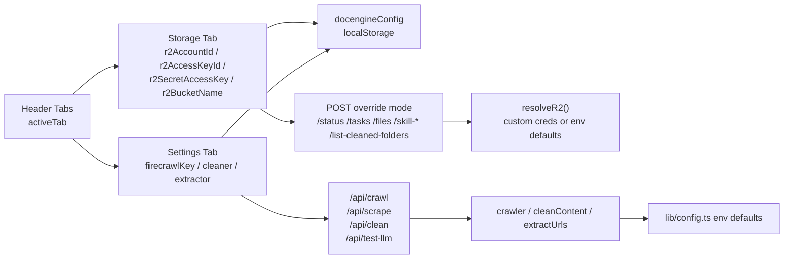

# Storage 與 Settings 分頁

本頁只聚焦 `app/page.tsx` 裡的 `storage` 與 `settings` 兩個分頁：前者不是檔案瀏覽器，而是「R2 覆蓋連線設定面板」；後者則集中管理 Firecrawl、內容清洗 LLM、URL Extractor 三組執行期參數。兩者都不是獨立路由，而是同一個 client page 內由 `activeTab` 切換出的 UI 區塊。 Sources: [page.tsx](app/page.tsx#L92-L159), [page.tsx](app/page.tsx#L1097-L1113), [page.tsx](app/page.tsx#L2367-L2707)

這兩個分頁也都沒有各自的「Save」按鈕；它們改的是共享 React state，而這批設定會在 mount 後透過 `docengineConfig` 自動寫入 `localStorage`，之後再被 Create / Tasks / Skill 等其他互動路徑直接拿去組 API 請求。Sources: [page.tsx](app/page.tsx#L335-L374), [page.tsx](app/page.tsx#L436-L470), [page.tsx](app/page.tsx#L519-L550), [page.tsx](app/page.tsx#L566-L606), [page.tsx](app/page.tsx#L699-L721), [page.tsx](app/page.tsx#L2030-L2068)

## 核心資料流

可以把這頁看成兩條共用設定總線：Storage 分頁決定 R2 讀寫與查詢時是否帶前端覆蓋認證；Settings 分頁決定 scrape / clean / URL extract 要帶哪些 runtime 參數。兩者都先更新 state，再由既有 effect 或 handler 把設定送進 API，而不是在 tab 內直接呼叫某個「設定儲存端點」。 Sources: [page.tsx](app/page.tsx#L335-L470), [page.tsx](app/page.tsx#L476-L550), [page.tsx](app/page.tsx#L566-L606), [page.tsx](app/page.tsx#L675-L721), [page.tsx](app/page.tsx#L2030-L2068), [r2.ts](lib/r2.ts#L58-L86)

## 關鍵欄位與下游映射

| 設定群組 | 前端 state / 欄位 | 直接下游 | 後端落點與 fallback | 證據 |
| --- | --- | --- | --- | --- |
| Storage / R2 | `r2AccountId`, `r2AccessKeyId`, `r2SecretAccessKey`, `r2BucketName` | `/api/status`, `/api/tasks`, `/api/files`, `/api/skill-tasks`, `/api/skill-status`, `/api/list-cleaned-folders`, `/api/clean` | 先組成 `R2Overrides`，再由 `resolveR2()` 決定走自訂憑證或環境預設 client；`bucketName` 可單獨覆蓋 bucket | [page.tsx](app/page.tsx#L156-L159), [page.tsx](app/page.tsx#L225-L253), [page.tsx](app/page.tsx#L476-L550), [page.tsx](app/page.tsx#L971-L1077), [page.tsx](app/page.tsx#L2030-L2068), [r2.ts](lib/r2.ts#L24-L30), [r2.ts](lib/r2.ts#L58-L86), [route.ts](app/api/files/route.ts#L12-L43), [route.ts](app/api/tasks/route.ts#L67-L81), [route.ts](app/api/status/[taskId]/route.ts#L31-L62), [route.ts](app/api/skill-tasks/route.ts#L35-L63), [route.ts](app/api/skill-status/[taskId]/route.ts#L20-L34), [route.ts](app/api/list-cleaned-folders/route.ts#L59-L79), [route.ts](app/api/clean/route.ts#L20-L24) |
| Scraping Processor | `firecrawlKey` | 批次 crawl 建任務、單頁 scrape、crawl-job 探索 | 前端把 key 送進 `/api/crawl` / `/api/scrape` / `/api/crawl-job`；`crawler` 端若未覆蓋則退回 `config.firecrawl.apiKey/apiUrl` | [page.tsx](app/page.tsx#L105-L110), [page.tsx](app/page.tsx#L579-L606), [page.tsx](app/page.tsx#L699-L721), [page.tsx](app/page.tsx#L768-L777), [route.ts](app/api/crawl/route.ts#L12-L29), [scrape-task.ts](lib/services/scrape-task.ts#L164-L172), [crawler.ts](lib/services/crawler.ts#L13-L29), [crawler.ts](lib/services/crawler.ts#L74-L107), [config.ts](lib/config.ts#L1-L5) |
| LLM Content Cleaner | `llmApiKey`, `llmBaseUrl`, `llmModelName`, `cleaningPrompt` | 單頁 scrape 清洗、既有 raw 重新 clean、連線測試 | runtime 會走 `cleanContent()`，缺值時退回 `config.llm.contentCleaner.*` 與預設 prompt；測試按鈕走 `/api/test-llm` 的 chatCompletion 路徑 | [page.tsx](app/page.tsx#L107-L111), [page.tsx](app/page.tsx#L713-L716), [page.tsx](app/page.tsx#L1071-L1077), [page.tsx](app/page.tsx#L2460-L2579), [route.ts](app/api/clean/route.ts#L44-L68), [scrape-task.ts](lib/services/scrape-task.ts#L179-L185), [cleaner.ts](lib/processors/cleaner.ts#L55-L83), [route.ts](app/api/test-llm/route.ts#L15-L103), [config.ts](lib/config.ts#L12-L16) |
| URL Extractor | `urlExtractorApiKey`, `urlExtractorBaseUrl`, `urlExtractorModel`, `urlExtractorPrompt` | `/api/crawl` 建任務前的 URL 解析、連線測試 | `/api/crawl` 先抽出 extractor overrides，再交給 `extractUrls()`；若未覆蓋則退回 `config.llm.urlExtractor.*` 與內建 prompt | [page.tsx](app/page.tsx#L113-L118), [page.tsx](app/page.tsx#L590-L606), [page.tsx](app/page.tsx#L2583-L2701), [route.ts](app/api/crawl/route.ts#L21-L29), [url-extractor.ts](lib/processors/url-extractor.ts#L13-L23), [url-extractor.ts](lib/processors/url-extractor.ts#L111-L135), [config.ts](lib/config.ts#L7-L11) |
| 本地持久化 | `docengineConfig` | 重新整理後還原 Storage / Settings 輸入值 | mount 時讀回；任何欄位變更後自動覆寫 | [page.tsx](app/page.tsx#L335-L374), [page.tsx](app/page.tsx#L436-L470) |

這張表真正想表達的重點是：Storage / Settings 並不是單純的表單展示，而是整個單頁控制台的共享設定來源；一旦 state 改變，後續任務建立、歷史查詢、檔案下載、重新清洗與資料夾列舉都會讀到同一份值。 Sources: [page.tsx](app/page.tsx#L436-L470), [page.tsx](app/page.tsx#L476-L550), [page.tsx](app/page.tsx#L566-L606), [page.tsx](app/page.tsx#L699-L721), [page.tsx](app/page.tsx#L971-L1077), [page.tsx](app/page.tsx#L2030-L2068)

## Storage 分頁：它設定的是 R2 連線語境，不是物件列表

Storage 分頁的 UI 只有四個欄位：`Account ID`、`Bucket Name`、`Access Key ID`、`Secret Access Key`，外加一個連線狀態燈號。燈號判斷條件只看 `r2AccountId && r2AccessKeyId && r2SecretAccessKey`，成立時顯示「Credentials configured (using custom)」，否則顯示會退回 server environment defaults；`bucketName` 本身不參與這個綠燈判斷。 Sources: [page.tsx](app/page.tsx#L2367-L2425)

這個分頁本身不會列出任何 R2 內容；真正的 R2 查詢發生在其他互動裡。Tasks 監控輪詢 `/api/status/[taskId]`、Tasks 分頁歷史列表讀 `/api/tasks`、監控抽屜用 `/api/files` 查 raw/cleaned 檔案大小、Skill 分頁用 `/api/skill-tasks` 與 `/api/skill-status/[taskId]` 看歷史/輪詢，另有 `/api/list-cleaned-folders` 用來刷新可選 cleaned folder。只要前端判定「任一 R2 欄位非空」，這些查詢就會切到帶 body 的 POST override 模式。 Sources: [page.tsx](app/page.tsx#L225-L253), [page.tsx](app/page.tsx#L255-L282), [page.tsx](app/page.tsx#L476-L550), [page.tsx](app/page.tsx#L971-L999), [page.tsx](app/page.tsx#L2030-L2068), [route.ts](app/api/tasks/route.ts#L67-L81), [route.ts](app/api/status/[taskId]/route.ts#L31-L62), [route.ts](app/api/files/route.ts#L12-L43), [route.ts](app/api/skill-tasks/route.ts#L35-L63), [route.ts](app/api/skill-status/[taskId]/route.ts#L20-L34), [route.ts](app/api/list-cleaned-folders/route.ts#L59-L79)

後端真正吃掉這些欄位的是 `lib/r2.ts`。`resolveR2()` 先決定 bucket：優先用 `overrides.bucketName`，否則退回 `config.r2.bucketName`；接著只要偵測到任一 credential override 存在，就會進入自訂 client 路徑，並要求 `accountId`、`accessKeyId`、`secretAccessKey` 最終都能湊齊，否則直接丟 `Incomplete R2 credentials`。如果只有 `bucketName` 覆蓋、沒有 credentials 覆蓋，則會沿用環境變數預設 client。 Sources: [r2.ts](lib/r2.ts#L35-L41), [r2.ts](lib/r2.ts#L58-L86), [config.ts](lib/config.ts#L26-L31)

Storage 設定也不只影響「讀」；Create 分頁批次 crawl 會把 R2 覆蓋值包進 `engineSettings` 送往 `/api/crawl`，單頁 scrape 則直接把 `r2AccountId`、`r2AccessKeyId`、`r2SecretAccessKey`、`r2BucketName` 送往 `/api/scrape`，而重新清洗 `/api/clean` 也會在 body 裡傳 `r2Overrides`。因此這個分頁實際上同時控制任務 JSON、raw/cleaned 檔案、skill task JSON 的讀寫位置與認證方式。 Sources: [page.tsx](app/page.tsx#L579-L606), [page.tsx](app/page.tsx#L699-L721), [page.tsx](app/page.tsx#L1071-L1077), [route.ts](app/api/crawl/route.ts#L49-L76), [route.ts](app/api/scrape/route.ts#L20-L37), [route.ts](app/api/clean/route.ts#L20-L24), [scrape-task.ts](lib/services/scrape-task.ts#L162-L168), [scrape-task.ts](lib/services/scrape-task.ts#L188-L206), [r2.ts](lib/r2.ts#L137-L157)

## Settings 分頁：三組 runtime 參數共用一個持久化機制

Settings 分頁只呈現三塊卡片：`Scraping Processor`、`LLM Content Cleaner`、`URL Extractor (LLM)`。它不負責 Skill Generator provider/model，那一套 state 雖然也會被一起寫進 `docengineConfig`，但 UI 不在這個分頁。就本頁範圍來說，Settings 主要管的是建立 crawl/scrape 任務與內容處理的執行期參數。 Sources: [page.tsx](app/page.tsx#L2431-L2707), [page.tsx](app/page.tsx#L445-L453)

`Scraping Processor` 目前只有一個 Firecrawl API key 欄位與固定的 `Firecrawl (mendable)` provider 選單；這個 key 會在批次 `handleSubmit()`、單頁 `handleScrape()`、以及 crawl preflight `handleCrawl()` 時被帶進 API。後端 `crawler` 服務在建立 `FirecrawlApp` 時，會優先使用覆蓋 `apiKey/apiUrl`，否則退回 `config.firecrawl.apiKey/apiUrl`。 Sources: [page.tsx](app/page.tsx#L2437-L2457), [page.tsx](app/page.tsx#L579-L606), [page.tsx](app/page.tsx#L699-L721), [page.tsx](app/page.tsx#L768-L777), [route.ts](app/api/crawl/route.ts#L79-L86), [scrape-task.ts](lib/services/scrape-task.ts#L164-L172), [crawler.ts](lib/services/crawler.ts#L13-L29), [config.ts](lib/config.ts#L1-L5)

`LLM Content Cleaner` 讓使用者改 `API Key`、`Base URL`、`Model` 與 `Custom Cleaning Prompt`，並可把 prompt 重設回內建預設值；同區塊的 `Test Connection` 會呼叫 `/api/test-llm`，送出 `apiKey`、`baseUrl`、`model`。真正執行清洗時，單頁 scrape 會在 `runSingleScrapeTask()` 內把這些欄位交給 `cleanContent()`，而抽屜中的 re-clean 也會透過 `/api/clean` 傳入 `engineSettings`；`cleanContent()` 若沒拿到覆蓋值，會退回 `config.llm.contentCleaner` 與預設 system prompt。 Sources: [page.tsx](app/page.tsx#L2460-L2579), [page.tsx](app/page.tsx#L713-L716), [page.tsx](app/page.tsx#L1071-L1077), [route.ts](app/api/clean/route.ts#L44-L68), [scrape-task.ts](lib/services/scrape-task.ts#L179-L185), [cleaner.ts](lib/processors/cleaner.ts#L11-L18), [cleaner.ts](lib/processors/cleaner.ts#L55-L83), [route.ts](app/api/test-llm/route.ts#L15-L103), [config.ts](lib/config.ts#L12-L16)

`URL Extractor (LLM)` 這組設定只在 `/api/crawl` 前置解析原始輸入時使用：前端把 `urlExtractorApiKey`、`urlExtractorBaseUrl`、`urlExtractorModel`、`urlExtractorPrompt` 組進 `engineSettings`，後端 `/api/crawl` 先抽出 `urlExtractorOverrides`，再交給 `extractUrls()`。`extractUrls()` 會先處理「純 URL 清單 / sitemap」，只有在輸入不是 URL 清單時才進到 LLM 路徑，並在缺少覆蓋值時退回 `config.llm.urlExtractor.*` 與預設 extractor prompt。Sources: [page.tsx](app/page.tsx#L2583-L2701), [page.tsx](app/page.tsx#L590-L606), [route.ts](app/api/crawl/route.ts#L21-L29), [url-extractor.ts](lib/processors/url-extractor.ts#L18-L23), [url-extractor.ts](lib/processors/url-extractor.ts#L23-L51), [url-extractor.ts](lib/processors/url-extractor.ts#L111-L135), [config.ts](lib/config.ts#L7-L11)

需要特別注意的是，兩個 `Test Connection` 按鈕都共用 `/api/test-llm`；當請求裡沒有 `provider` 時，這個端點會走 `chatCompletion` 路徑，並明確要求 `apiKey` 與 `baseUrl` 都存在，否則回 400。這表示「留白讓 runtime 走 server env defaults」與「按下 Test Connection」不是完全等價的體驗：前者在實際清洗/抽取時可能成功，後者則可能因缺少顯式輸入而測試失敗。 Sources: [page.tsx](app/page.tsx#L2537-L2559), [page.tsx](app/page.tsx#L2660-L2682), [route.ts](app/api/test-llm/route.ts#L39-L83), [cleaner.ts](lib/processors/cleaner.ts#L61-L68), [url-extractor.ts](lib/processors/url-extractor.ts#L116-L126), [config.ts](lib/config.ts#L7-L16)

## 常見坑點 / 判讀重點

第一個坑是「半套 R2 覆蓋」。前端只要看到任一 R2 欄位非空，就會把多個查詢切到 POST override 模式；但 `resolveR2()` 一旦判定要走 credential override，卻要求 `accountId`、`accessKeyId`、`secretAccessKey` 三者完整。結果就是：原本可以用環境變數正常工作的查詢，可能因為使用者只填了其中一兩格而壞掉。 Sources: [page.tsx](app/page.tsx#L225-L240), [page.tsx](app/page.tsx#L478-L490), [page.tsx](app/page.tsx#L525-L537), [page.tsx](app/page.tsx#L978-L983), [r2.ts](lib/r2.ts#L60-L71)

第二個坑是「Settings 雖然寫成 Leave blank for default env，但測試按鈕不一定接受空白」。`cleanContent()` 與 `extractUrls()` 都有 env fallback，可是 `/api/test-llm` 的非 provider 路徑要求顯式 `apiKey` 與 `baseUrl`。所以如果把 Settings 分頁當成純 runtime override 面板，與把它當成可直接驗證 env fallback 的診斷面板，得到的結論可能不同。 Sources: [page.tsx](app/page.tsx#L2442-L2449), [page.tsx](app/page.tsx#L2465-L2483), [page.tsx](app/page.tsx#L2589-L2607), [route.ts](app/api/test-llm/route.ts#L55-L69), [cleaner.ts](lib/processors/cleaner.ts#L61-L68), [url-extractor.ts](lib/processors/url-extractor.ts#L116-L120), [config.ts](lib/config.ts#L7-L16)

第三個坑是本地持久化的安全邊界。`docengineConfig` 寫回時直接包含 `firecrawlKey`、`llmApiKey`、`urlExtractorApiKey`、`r2AccessKeyId`、`r2SecretAccessKey` 等欄位；程式碼沒有在寫入前做遮罩或拆分。也就是說，這兩個分頁的便利性是用瀏覽器端持久化換來的，不適合把共享工作站或不受信任瀏覽器視為安全憑證倉庫。 Sources: [page.tsx](app/page.tsx#L436-L470)
