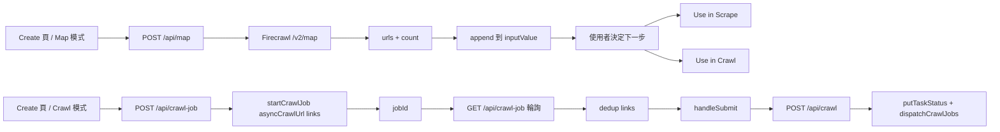

# Map API 與 Crawl Job API 的探索前置流程

## 本頁範圍與讀者定位

本頁聚焦 Create 頁裡兩條「先找 URL、再決定下一步」的前置鏈路。`/api/map` 是同步 map 查詢：後端把 Firecrawl 找回來的網址清單直接回傳，前端只把它們 append 回共用輸入框；`/api/crawl-job` 則是非同步 crawl exploration：先啟動 Firecrawl job、輪詢拿 links，最後把 links 交給 `handleSubmit()` 呼叫 `/api/crawl` 建立真正的批次任務。也就是說，兩者都屬於探索階段，但只有 crawl-job 會在同一次操作裡銜接到正式 task 建立。 Sources: [page.tsx](app/page.tsx#L566-L606), [page.tsx](app/page.tsx#L627-L673), [page.tsx](app/page.tsx#L759-L827), [app/api/map/route.ts](app/api/map/route.ts#L8-L96), [app/api/crawl-job/route.ts](app/api/crawl-job/route.ts#L4-L67), [app/api/crawl/route.ts](app/api/crawl/route.ts#L10-L98)

## 核心流程

這兩條流程的真正分水嶺，是「探索結果誰來接手」。Map 路徑在拿到 `urls` 後就停在 UI，讓使用者自行改走 Scrape 或 Crawl；Crawl Job 路徑則在 polling 成功後立刻把 `links.join('\n')` 送進 `/api/crawl`，因此它不是獨立任務系統，而是批次 crawl 建任務前的一段探索前置。 Sources: [page.tsx](app/page.tsx#L655-L660), [page.tsx](app/page.tsx#L784-L820), [page.tsx](app/page.tsx#L1436-L1453), [app/api/crawl-job/route.ts](app/api/crawl-job/route.ts#L48-L67), [app/api/crawl/route.ts](app/api/crawl/route.ts#L42-L98)

## Map API：同步網址盤點器

`/api/map` 的責任很單純：驗證 `url` 後，優先取前端傳入的 `firecrawlKey`，否則退回 `config.firecrawl.apiKey`；接著自行組出 `${config.firecrawl.apiUrl}/v2/map`，把 `url`、`limit`（預設 5000）、`includeSubdomains`（預設 `true`）、`ignoreQueryParameters: true` 與可選 `search` 打給 Firecrawl。這代表 Map API 是 route 內直接代理 Firecrawl Map 端點，而不是透過共用 `crawler.ts` 再包一層。 Sources: [app/api/map/route.ts](app/api/map/route.ts#L8-L51), [config.ts](lib/config.ts#L1-L5)

Map 路由對 Firecrawl 錯誤也做了比較細的同步翻譯：`402` 會改寫成 quota exceeded，`429` 會改寫成 rate limit reached，其餘錯誤則嘗試從回應 body 解析 `error` 或 `message`。成功時它只把 `data.links` 轉成字串陣列、過濾空值，然後回傳 `{ success, urls, count }`；這裡沒有額外 `Set` 去重，也沒有任何 task 或 R2 寫入。 Sources: [app/api/map/route.ts](app/api/map/route.ts#L53-L96)

前端 `handleMapFetch()` 送出的 body 只有 `url`、`search`、`limit` 與 `firecrawlKey`。成功後若有結果，UI 會把 `data.urls.join('\n')` append 到既有 `inputValue` 尾端，並用 `mapResultCount` 顯示成功提示；如果沒有結果，就只顯示錯誤訊息。因為這裡沒有送 `includeSubdomains`，所以目前 Create 頁上的子網域策略其實完全由後端預設值決定。 Sources: [page.tsx](app/page.tsx#L627-L673), [app/api/map/route.ts](app/api/map/route.ts#L11-L12), [app/api/map/route.ts](app/api/map/route.ts#L31-L40)

## Crawl Job API：非同步探索後立刻轉批次

`handleCrawl()` 的入口是 `crawlUrl` 與 `crawlLimit`。它先 POST `/api/crawl-job`，送出 `url`、數字化後的 `limit`，以及只含 `firecrawlApiKey` 的 `engineSettings`；後端 route 則驗證 `url`、把 `limit` 預設成 100，並支援把 `engineSettings.firecrawlApiKey` / `engineSettings.firecrawlApiUrl` 轉成 Firecrawl overrides 後呼叫 `startCrawlJob()`。也就是說，route 支援 API URL override，但目前這個 UI 只真正送了 API key。 Sources: [page.tsx](app/page.tsx#L759-L777), [app/api/crawl-job/route.ts](app/api/crawl-job/route.ts#L4-L24)

真正的 job 啟動邏輯在 `lib/services/crawler.ts`。`getFirecrawl()` 會用 `apiKey-apiUrl` 組成簽章快取 `FirecrawlApp` 實例；`startCrawlJob()` 則呼叫 `asyncCrawlUrl()`，而且 `scrapeOptions.formats` 明確只要求 `['links']`。這說明 crawl-job 前置流程的目標不是抓 markdown，而是讓 Firecrawl 幫系統先探索可處理的連結集合。 Sources: [crawler.ts](lib/services/crawler.ts#L13-L29), [crawler.ts](lib/services/crawler.ts#L110-L136)

開始 job 之後，前端進入 `while (!isCompleted)` 輪詢，每輪固定等待 4 秒，再以 `jobId` 與可選 `apiKey` GET `/api/crawl-job`。GET route 會呼叫 `checkCrawlJob()`，在 `status === 'completed'` 時從每筆資料取 `metadata.sourceURL || url`，再用 `Set` 去重後回傳 `links`；前端則把 `failed`、`cancelled` 視為錯誤，其餘狀態一律當成仍在探索中並更新進度文案。 Sources: [page.tsx](app/page.tsx#L784-L810), [app/api/crawl-job/route.ts](app/api/crawl-job/route.ts#L34-L67), [crawler.ts](lib/services/crawler.ts#L138-L150)

一旦拿到 links，`handleCrawl()` 會把它們用換行串起來，直接呼叫 `handleSubmit(queueInput)`。而 `handleSubmit()` 本身只是把輸入送到 `/api/crawl`；真正的 task 建立發生在 `app/api/crawl/route.ts`，那裡才會 `extractUrls()`、產生 `taskId`、寫入 `putTaskStatus()`，再交給 `dispatchCrawlJobs()`。所以 `crawl-job` 本身保存的是 Firecrawl job 狀態，不是本地任務狀態。 Sources: [page.tsx](app/page.tsx#L566-L606), [page.tsx](app/page.tsx#L816-L820), [app/api/crawl/route.ts](app/api/crawl/route.ts#L19-L98)

## 關鍵模組 / 檔案導覽

| 檔案 | 角色 | 本頁相關重點 |
| --- | --- | --- |
| [`app/page.tsx#L627-L673`](app/page.tsx#L627-L673), [`app/page.tsx#L759-L827`](app/page.tsx#L759-L827), [`app/page.tsx#L1362-L1453`](app/page.tsx#L1362-L1453) | Create 頁前端協調層 | `handleMapFetch()` append URLs、`handleCrawl()` poll job 後轉 `handleSubmit()`，Map 結果只提供 `Use in Scrape` / `Use in Crawl` 兩個 UI 分流。 |
| [`app/api/map/route.ts#L8-L96`](app/api/map/route.ts#L8-L96) | Map 後端入口 | 直接代理 Firecrawl `/v2/map`，回傳 `urls` 與 `count`，不建 task。 |
| [`app/api/crawl-job/route.ts#L4-L67`](app/api/crawl-job/route.ts#L4-L67) | Crawl exploration start / poll 入口 | POST 建 Firecrawl job，GET 讀 job 狀態並整理 `links`。 |
| [`lib/services/crawler.ts#L13-L29`](lib/services/crawler.ts#L13-L29), [`lib/services/crawler.ts#L110-L150`](lib/services/crawler.ts#L110-L150) | 共用 Firecrawl service | 快取 Firecrawl client，提供 `startCrawlJob()` 與 `checkCrawlJob()`。 |
| [`app/api/crawl/route.ts#L10-L98`](app/api/crawl/route.ts#L10-L98) | 正式批次任務建立入口 | 只有這裡會建立 `taskId`、寫 `tasks/{taskId}.json` 並 dispatch。 |

從這些檔案分工可以看出：Map API 是純 discovery proxy，Crawl Job API 是 discovery orchestration，而真正的任務系統仍然由 `/api/crawl` 掌管。 Sources: [app/api/map/route.ts](app/api/map/route.ts#L8-L96), [app/api/crawl-job/route.ts](app/api/crawl-job/route.ts#L4-L67), [lib/services/crawler.ts](lib/services/crawler.ts#L110-L150), [app/api/crawl/route.ts](app/api/crawl/route.ts#L42-L98)

## 差異與踩坑

第一個容易誤會的點是「Map 找到的網址能不能直接拿去做 crawl-job」。目前答案是否定的：Map 模式成功後只會顯示 `Use in Scrape` / `Use in Crawl` 兩顆按鈕，而 `Use in Crawl` 的實作只是把 `inputValue.split('\n')[0]` 填回 `crawlUrl`。換句話說，Map 的完整結果集不會直接餵進 `/api/crawl-job`；目前 UI 只把第一行當成新的 crawl entry point。 Sources: [page.tsx](app/page.tsx#L1436-L1453)

第二個差異是去重策略。Map route 只把 `data.links` 映射成 `urls` 後回傳，前端再原樣 append 到既有輸入框，因此重複 mapping、或與既有手動輸入重疊時，都可能累加出重複列；Crawl Job 的 GET route 則會先把 `metadata.sourceURL || url` 丟進 `Set` 去重，再回傳給前端。 Sources: [app/api/map/route.ts](app/api/map/route.ts#L84-L96), [page.tsx](app/page.tsx#L655-L660), [app/api/crawl-job/route.ts](app/api/crawl-job/route.ts#L50-L59)

第三個實務風險在輪詢控制。`handleCrawl()` 目前沒有額外的最大輪數、timeout guard 或 abort 條件；只要狀態不是 `completed`、`failed`、`cancelled`，就會每 4 秒繼續輪詢並更新「Exploring...」文案。因此 UI 對 job liveness 的判斷完全依賴 Firecrawl 狀態最終轉移。 Sources: [page.tsx](app/page.tsx#L785-L810), [app/api/crawl-job/route.ts](app/api/crawl-job/route.ts#L61-L67)

第四個要注意的是「後端支援比目前 UI 多」。Map 後端支援 `includeSubdomains`，但 Create 頁沒送；Crawl Job route 支援 `firecrawlApiUrl` override，但目前 Create 頁只送 `firecrawlApiKey`。因此這兩條前置流程在此頁上的實際行為，仍然高度受 `lib/config.ts` 裡的 `FIRECRAWL_API_KEY` / `FIRECRAWL_API_URL` 預設值影響。 Sources: [page.tsx](app/page.tsx#L641-L646), [page.tsx](app/page.tsx#L773-L777), [app/api/map/route.ts](app/api/map/route.ts#L11-L12), [app/api/map/route.ts](app/api/map/route.ts#L31-L36), [app/api/crawl-job/route.ts](app/api/crawl-job/route.ts#L15-L18), [config.ts](lib/config.ts#L1-L5)

## 證據邊界

這一頁只描述 repo 內能直接驗證的 orchestration 行為，不延伸猜測 Firecrawl 更完整的外部回應 schema。從本地程式碼能確認的只有：Map route 假設 `data.links` 裡的元素可能是字串或帶 `url` 欄位的物件；Crawl Job GET 則只消費 `metadata.sourceURL` 或 `url`。更細的 Firecrawl payload 契約不在這個 repo 內定義，因此本頁不做額外推論。 Sources: [app/api/map/route.ts](app/api/map/route.ts#L75-L88), [app/api/crawl-job/route.ts](app/api/crawl-job/route.ts#L50-L59)
