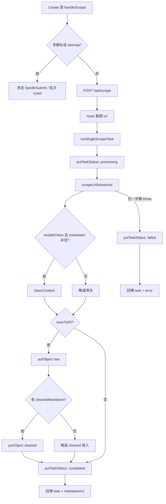

# 單頁 Scrape 任務服務

本頁聚焦 `/api/scrape` 背後的後端服務層：只有當 Create 頁的 `handleScrape()` 判定輸入是單一 URL 時，前端才會送出單頁請求；route 自己只做 `url` 驗證，真正把請求轉成標準 `JobTask`、執行 Firecrawl scrape、可選清洗與 R2 寫入的核心，全部集中在 `runSingleScrapeTask()`。Sources: [app/page.tsx](app/page.tsx#L676-L756), [app/api/scrape/route.ts](app/api/scrape/route.ts#L8-L46), [lib/services/scrape-task.ts](lib/services/scrape-task.ts#L155-L241)

## 核心流程

Sources: [app/page.tsx](app/page.tsx#L676-L756), [app/api/scrape/route.ts](app/api/scrape/route.ts#L8-L46), [lib/services/scrape-task.ts](lib/services/scrape-task.ts#L155-L240), [lib/services/crawler.ts](lib/services/crawler.ts#L74-L108), [lib/processors/cleaner.ts](lib/processors/cleaner.ts#L55-L87), [lib/r2.ts](lib/r2.ts#L89-L100), [lib/r2.ts](lib/r2.ts#L137-L157)

這條鏈的關鍵不是「先拿到內容，再補一筆 task」，而是相反：service 一開始就先產生 `taskId`、`date`、`createdAt` 與 `processing` 狀態，立即寫入 `tasks/{taskId}.json`，之後才進入 scrape、清洗與儲存分支，因此單頁 Scrape 在資料模型上從一開始就是標準任務，而不是預覽專用的旁支資料。Sources: [lib/services/scrape-task.ts](lib/services/scrape-task.ts#L135-L168), [lib/r2.ts](lib/r2.ts#L137-L149), [lib/utils/helpers.ts](lib/utils/helpers.ts#L4-L16), [lib/utils/task-metadata.ts](lib/utils/task-metadata.ts#L71-L84)

## 關鍵模組 / 檔案導覽

| 檔案 | 角色 | 本頁關心的重點 |
|---|---|---|
| `app/page.tsx` | 前端單頁入口 | `handleScrape()` 只在單一 URL 時呼叫 `/api/scrape`，成功或失敗都可能把回傳的 `taskId`/`task` 接到前端狀態。 |
| `app/api/scrape/route.ts` | HTTP 入口 | 只驗證 `url` 是否存在且為字串，之後完全委派給 `runSingleScrapeTask()`。 |
| `lib/services/scrape-task.ts` | 核心協調器 | 定義輸入/輸出型別、參數正規化、task 建立、scrape、clean、R2 寫入與最終狀態更新。 |
| `lib/services/crawler.ts` / `lib/processors/cleaner.ts` | 下游能力 | 前者包 Firecrawl advanced scrape；後者包 LLM 清理，兩者都由 service 視條件呼叫。 |
| `lib/r2.ts` / `app/api/status/[taskId]/route.ts` / `app/api/tasks/route.ts` | 持久化與查詢 | `putTaskStatus()` 固定寫 `tasks/{taskId}.json`；status 與 tasks API 都從這個前綴讀回單頁任務。 |
| `tests/scrape-task.test.ts` | 回歸保護 | 驗證成功與失敗兩種生命週期都會經過 `processing -> completed/failed` 的雙寫入。 |

Sources: [app/page.tsx](app/page.tsx#L676-L756), [app/page.tsx](app/page.tsx#L472-L517), [app/api/scrape/route.ts](app/api/scrape/route.ts#L8-L46), [lib/services/scrape-task.ts](lib/services/scrape-task.ts#L9-L241), [lib/services/crawler.ts](lib/services/crawler.ts#L74-L108), [lib/processors/cleaner.ts](lib/processors/cleaner.ts#L55-L87), [lib/r2.ts](lib/r2.ts#L89-L100), [lib/r2.ts](lib/r2.ts#L137-L157), [app/api/status/[taskId]/route.ts](app/api/status/[taskId]/route.ts#L9-L67), [app/api/tasks/route.ts](app/api/tasks/route.ts#L22-L87), [tests/scrape-task.test.ts](tests/scrape-task.test.ts#L6-L156)

## 服務輸入與正規化

`SingleScrapeTaskInput` 把單頁服務拆成四組輸入：URL 與 Firecrawl key、進階 scrape 參數（`waitFor`、`timeout`、`onlyMainContent`、`mobile`、`includeTags`、`excludeTags`）、清洗參數（`enableClean` 與 `llm*` 欄位），以及 R2 覆蓋欄位。這些欄位不是在 route 層逐一驗證，而是進到 service 後再用 `parseOptionalNumber()`、`parseOptionalTags()`、`buildR2Overrides()` 與 `buildScrapeOptions()` 做正規化。Sources: [app/api/scrape/route.ts](app/api/scrape/route.ts#L8-L23), [lib/services/scrape-task.ts](lib/services/scrape-task.ts#L9-L29), [lib/services/scrape-task.ts](lib/services/scrape-task.ts#L71-L133)

這代表 optional 參數的策略比較偏「容錯轉換」而不是「嚴格拒絕」：空字串會變成 `undefined`，tag 字串會按逗號切開後 trim，`waitFor` / `timeout` 則只有在可被 `parseInt` 解析成有限數字時才會進入 Firecrawl options；最後真正傳給 Firecrawl 的 `scrapeParams` 只包含有值的欄位。Sources: [lib/services/scrape-task.ts](lib/services/scrape-task.ts#L71-L133), [lib/services/crawler.ts](lib/services/crawler.ts#L74-L108)

## 任務生命週期與資料模型

`runSingleScrapeTask()` 的第一個持久化動作是 `putTaskStatus(taskId, baseTask, r2Overrides)`：`baseTask` 由 `buildBaseTask()` 建出，固定 `total = 1`、`completed = 0`、`failed = 0`、`urls = [{ url, status: 'processing' }]`，並用 `summarizeDomains([url])` 補齊 `domains` 與 `domainSummary`。成功時 service 會把同一筆 task 改成 `completed` 與 `urls: [{ status: 'success' }]`；失敗時則改成 `failed`、補 `failedUrls` 與 `urls[].error`。Sources: [lib/services/scrape-task.ts](lib/services/scrape-task.ts#L135-L168), [lib/services/scrape-task.ts](lib/services/scrape-task.ts#L198-L240), [lib/utils/task-metadata.ts](lib/utils/task-metadata.ts#L71-L84), [lib/r2.ts](lib/r2.ts#L137-L149)

值得注意的是，`JobTask` 型別雖然容許 `engineSettings`，但單頁 service 建出的 `baseTask`、`completedTask`、`failedTask` 都沒有填這個欄位；也就是說，單頁 Scrape 會共用批次任務的外殼與儲存位置，但不會像 `/api/crawl` 那樣把一整組引擎設定持久化進 task JSON。Sources: [lib/r2.ts](lib/r2.ts#L5-L22), [lib/services/scrape-task.ts](lib/services/scrape-task.ts#L135-L153), [lib/services/scrape-task.ts](lib/services/scrape-task.ts#L198-L230)

## 清洗、R2 與失敗語義

主流程的執行順序很明確：先 `scrapeUrlAdvanced()` 拿 `markdown`/`metadata`，再在 `enableClean && markdown.trim().length > 0` 時呼叫 `cleanContent()`，之後若 `saveToR2` 為真才寫 raw 與可選 cleaned 檔，最後才把 task 寫成 `completed`。因此回傳給前端的成功 payload 會同時帶 `markdown`、`cleanedMarkdown`、`metadata`、字數統計，以及可選的 `r2.rawKey` / `r2.cleanedKey`。Sources: [lib/services/scrape-task.ts](lib/services/scrape-task.ts#L170-L220), [lib/services/crawler.ts](lib/services/crawler.ts#L74-L108), [lib/processors/cleaner.ts](lib/processors/cleaner.ts#L55-L87)

R2 路徑本身由 `buildR2Key()` 生成，形狀是 `raw|cleaned/{date}/{domain}/{path}.md`；task JSON 則固定落在 `tasks/{taskId}.json`。同一份 `r2Overrides` 會同時傳給 `putTaskStatus()` 與 `putObject()`，所以單頁任務的狀態檔與 raw/cleaned 檔案會一起走相同的 bucket / 認證來源。若覆蓋憑證不完整，`resolveR2()` 會直接丟錯；若流程在 raw 已寫入後、completed 狀態落檔前失敗，catch 只會把 task 標成 `failed`，不會回滾先前已寫入的物件。Sources: [lib/services/scrape-task.ts](lib/services/scrape-task.ts#L162-L168), [lib/services/scrape-task.ts](lib/services/scrape-task.ts#L188-L240), [lib/utils/helpers.ts](lib/utils/helpers.ts#L21-L44), [lib/r2.ts](lib/r2.ts#L58-L100), [lib/r2.ts](lib/r2.ts#L137-L149)

## 對外回傳與下游讀取

`/api/scrape` route 本身很薄，但有一個重要設計：如果 `runSingleScrapeTask()` 回傳的是 failure result，route 仍會把 `taskId` 與 `task` 一起放進 500 回應；前端 `handleScrape()` 也會在 `res.ok === false` 時先嘗試接上 `taskId` / `task`，再丟出錯誤。這讓單頁 scrape 即使失敗，仍然能被目前監控狀態接管，而不是只留下一則 toast 式錯誤訊息。Sources: [app/api/scrape/route.ts](app/api/scrape/route.ts#L22-L44), [app/page.tsx](app/page.tsx#L724-L755)

一旦前端拿到 `taskId`，它就會每 3 秒輪詢 `/api/status/[taskId]`；若有 R2 覆蓋值則改用 POST 把覆蓋欄位一併送出。後端 status route 只是把同一個 `taskId` 交給 `getTaskStatus()` 讀取 `tasks/{taskId}.json`，而 tasks route 則會列出 `tasks/` prefix、抓回前 20 筆並做 domain normalization，所以單頁 task 和批次 task 最終會出現在同一套查詢面。Sources: [app/page.tsx](app/page.tsx#L472-L517), [app/api/status/[taskId]/route.ts](app/api/status/[taskId]/route.ts#L9-L67), [app/api/tasks/route.ts](app/api/tasks/route.ts#L22-L87), [lib/r2.ts](lib/r2.ts#L145-L156), [lib/utils/task-metadata.ts](lib/utils/task-metadata.ts#L71-L84)

## 測試覆蓋與已知邊界

這個 service 被刻意寫成可注入依賴的形式：`SingleScrapeTaskDeps` 允許替換 `generateTaskId`、`now`、`scrapeUrlAdvanced`、`cleanContent`、`putObject`、`putTaskStatus`。測試便利用這個介面，固定 taskId/時間戳並攔截 task 更新，確認成功案例一定會寫兩次狀態（`processing -> completed`），失敗案例也一定會寫兩次狀態（`processing -> failed`）。Sources: [lib/services/scrape-task.ts](lib/services/scrape-task.ts#L51-L69), [tests/scrape-task.test.ts](tests/scrape-task.test.ts#L6-L85), [tests/scrape-task.test.ts](tests/scrape-task.test.ts#L87-L156)

目前已讀到的自動化覆蓋重點仍集中在生命週期本身：兩個測試案例都明確設定 `saveToR2: false` 與 `enableClean: false`，所以它們能穩固保護 task 狀態轉換、回傳 payload 與 domain summary，但不直接驗證 Cleaner 分支、R2 寫入分支，或「部分物件已寫入但任務最終 failed」這類副作用情境；這些行為需要靠程式碼順序本身來理解。Sources: [tests/scrape-task.test.ts](tests/scrape-task.test.ts#L9-L35), [tests/scrape-task.test.ts](tests/scrape-task.test.ts#L90-L111), [lib/services/scrape-task.ts](lib/services/scrape-task.ts#L175-L240)
