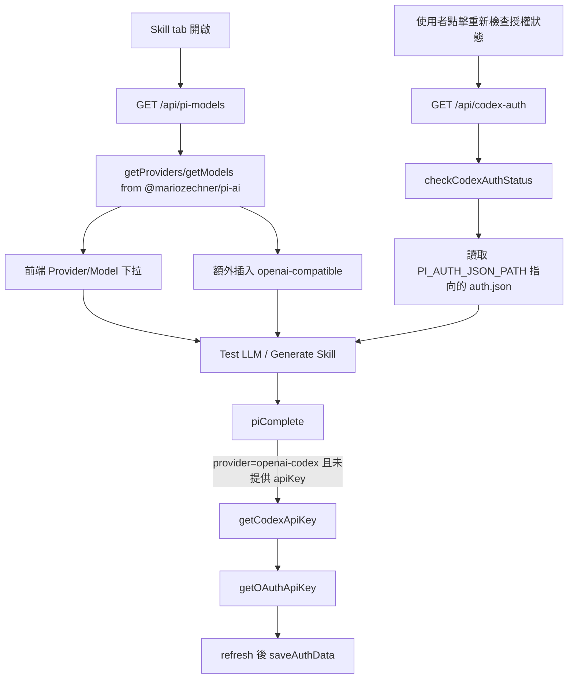

# pi-ai registry 與 Codex OAuth 端點

## 本頁範圍與讀者定位

本頁聚焦 Skill Generator 旁邊那兩個很薄、但會決定模型選單與 OAuth 可用性的入口：`GET /api/pi-models` 與 `GET /api/codex-auth`，並往下追到 `lib/oauth/pi-auth.ts`、`lib/services/pi-llm.ts` 與 `app/page.tsx`，說明「模型清單怎麼來、OAuth 狀態怎麼看、真正送出 LLM 呼叫時 token 又在哪裡被取用或刷新」；至於完整的 Skill 生成 phase 與檔案輸出，這頁只覆蓋它們和 registry / OAuth 的接點，不重講整條生成管線。 Sources: [route.ts](app/api/pi-models/route.ts#L23-L90), [route.ts](app/api/codex-auth/route.ts#L1-L16), [pi-auth.ts](lib/oauth/pi-auth.ts#L5-L98), [pi-llm.ts](lib/services/pi-llm.ts#L29-L141), [page.tsx](app/page.tsx#L180-L223), [page.tsx](app/page.tsx#L405-L434)

## 一張圖看懂 registry 與 OAuth 的兩條入口

這兩個 API 都不直接做重量級工作：`/api/pi-models` 只是把 `@mariozechner/pi-ai` 的本地 registry 包成前端可用 JSON，`/api/codex-auth` 也只回報伺服器端是否看得到 `openai-codex` 憑證；真正的模型驗證、OAuth token 取得與 refresh，發生在之後的 `piComplete()` / `getCodexApiKey()`。 Sources: [route.ts](app/api/pi-models/route.ts#L28-L90), [route.ts](app/api/codex-auth/route.ts#L4-L15), [pi-auth.ts](lib/oauth/pi-auth.ts#L54-L98), [pi-llm.ts](lib/services/pi-llm.ts#L32-L45)

## registry 端點：把 pi-ai 內建模型表轉成前端契約

`/api/pi-models` 直接從安裝中的 `@mariozechner/pi-ai` 讀 `getProviders()` 與 `getModels(providerId)`；它先把 provider ID 排序，再把每個 model 映射成 `id / name / api / baseUrl / reasoning / input / contextWindow / maxTokens`，最後再把 model 依名稱排序，所以這個端點不是向外部服務即時探測，而是把目前套件版本內建的 registry 穩定地轉成前端 schema。 Sources: [package.json](package.json#L11-L21), [route.ts](app/api/pi-models/route.ts#L1-L21), [route.ts](app/api/pi-models/route.ts#L28-L90)

這個 route 還會在真正的 pi-ai provider 清單前面插入一個合成的 `openai-compatible` provider，固定宣告 `api: 'openai-completions'`、預設 `baseUrl: 'https://api.openai.com/v1'`，並把 `supportsCustomModel` 設成 `true`；其餘 provider 則只有在「該 provider 的 API 類型只有一種，且那一種正好是 `openai-completions`」時才會被標成可自訂 model。 Sources: [route.ts](app/api/pi-models/route.ts#L30-L56), [route.ts](app/api/pi-models/route.ts#L57-L81)

前端在 mount 後會先 `fetch('/api/pi-models')` 載入這份 registry，再用它修正 localStorage 還原回來的 `skillProvider / skillModel`：若舊選項已不存在，就退回第一個可用 provider 與 model；而當使用者切到 `openai-compatible` 時，UI 會自動打開 custom model 模式，並把 base URL 預填成 registry 給的值。 Sources: [page.tsx](app/page.tsx#L335-L369), [page.tsx](app/page.tsx#L376-L434), [page.tsx](app/page.tsx#L1867-L1978)

## Codex OAuth 端點：只看狀態，不做登入流程

`/api/codex-auth` 的整個 route 檔只有一個 `GET` handler，而且內容只是呼叫 `checkCodexAuthStatus()` 後原樣回傳 JSON；repo 內沒有在這個 route 裡實作 redirect、callback 或 device-code 類型的登入流程，前端文案反而明確要求部署者先在伺服器執行 `npx @mariozechner/pi-ai login openai-codex`，再把產生的 `auth.json` 掛到 `PI_AUTH_JSON_PATH`。 Sources: [route.ts](app/api/codex-auth/route.ts#L1-L16), [page.tsx](app/page.tsx#L1833-L1858), [config.ts](lib/config.ts#L17-L24), [pi-auth.ts](lib/oauth/pi-auth.ts#L5-L15)

`checkCodexAuthStatus()` 本身也很單純：它先透過 `getAuthData()` 讀 `auth.json`，`getAuthData()` 會把相對路徑解析到 `process.cwd()` 之下；若檔案不存在或 JSON 解析失敗，就回 `null`，最後狀態 API 便回 `{ loggedIn: false }`；只有當 `auth['openai-codex']` 存在時，才回 `{ loggedIn: true, expires }`。 Sources: [pi-auth.ts](lib/oauth/pi-auth.ts#L5-L15), [pi-auth.ts](lib/oauth/pi-auth.ts#L20-L31), [pi-auth.ts](lib/oauth/pi-auth.ts#L51-L64)

真正會去取 token 的不是 `/api/codex-auth`，而是 `piComplete()`：當 provider 是 `openai-codex` 且呼叫端沒有顯式提供 `apiKey` 時，它才會呼叫 `getCodexApiKey()`；後者再把整份 auth 物件交給 `@mariozechner/pi-ai/oauth` 的 `getOAuthApiKey()`，如果回傳了 `newCredentials` 就把更新後的 `openai-codex` 憑證寫回磁碟。 Sources: [pi-llm.ts](lib/services/pi-llm.ts#L32-L45), [pi-auth.ts](lib/oauth/pi-auth.ts#L71-L98)

## 與 test-llm / generate-skill 的實際串接

在前端 UI 中，OAuth 面板不會自動查狀態；`codexAuth` 初始值是 `null`，只有使用者按下「重新檢查授權狀態」時才會 `fetch('/api/codex-auth')` 並更新 state。等到真正送出生成時，oauth 模式會把 provider 強制改成 `openai-codex`、model 固定成 `gpt-4o`，而且在 `submitSkillGeneration()` 裡刻意不傳 `apiKey` 與 `baseUrl`，把 token 解析責任留給後端。 Sources: [page.tsx](app/page.tsx#L181-L182), [page.tsx](app/page.tsx#L1824-L1858), [page.tsx](app/page.tsx#L284-L333), [page.tsx](app/page.tsx#L2108-L2135)

`/api/test-llm` 只要 request body 帶了 `provider`，就走 Skill Generator 的 `piComplete()` 路徑；而 `/api/generate-skill` 在背景 worker 解析預設值時，也特別對 `openai-codex` 排除了 `SKILL_GENERATOR_API_KEY` 的 env fallback，避免環境變數 API key 蓋掉 OAuth 流程。接著 `generateSkill()` 會把同一組 `provider / modelId / apiKey / baseUrl` 連續送進 `summarize → generate → refine` 三次 `piComplete()`。 Sources: [route.ts](app/api/test-llm/route.ts#L7-L55), [route.ts](app/api/generate-skill/route.ts#L81-L105), [skill-generator.ts](lib/processors/skill-generator.ts#L180-L249), [pi-llm.ts](lib/services/pi-llm.ts#L32-L45)

值得注意的是，registry UI 與執行層的 custom-model 規則並不完全相同：`/api/pi-models` 只會把 `supportsCustomModel` 開給 `openai-completions` 類型的 provider，但 `piComplete()` 的 fallback 邏輯其實允許「任何只有單一 API 類型的 provider」在找不到 model 時，用第一個 model 當 template 建立自訂 model；換句話說，前端是較保守的白名單，後端則稍微寬鬆。 Sources: [route.ts](app/api/pi-models/route.ts#L73-L81), [page.tsx](app/page.tsx#L1911-L1925), [pi-llm.ts](lib/services/pi-llm.ts#L73-L89)

## 關鍵模組 / 檔案導覽

| 檔案 | 角色 | 本頁關心的重點 | 證據 |
| --- | --- | --- | --- |
| `app/api/pi-models/route.ts` | registry adapter | 讀 pi-ai 內建 provider/model，補上 `openai-compatible`，輸出前端下拉需要的 schema。 | [route.ts](app/api/pi-models/route.ts#L1-L90) |
| `app/api/codex-auth/route.ts` | OAuth 狀態探針 | 只包 `checkCodexAuthStatus()`，不做登入或 refresh。 | [route.ts](app/api/codex-auth/route.ts#L1-L16) |
| `lib/oauth/pi-auth.ts` | auth.json 存取層 | 解析 `PI_AUTH_JSON_PATH`、讀寫 auth.json、在 refresh 後持久化新憑證。 | [pi-auth.ts](lib/oauth/pi-auth.ts#L5-L98) |
| `lib/services/pi-llm.ts` | pi-ai 呼叫橋接 | 用同一份 pi-ai registry 驗證 provider/model，並在 `openai-codex` 時取用 OAuth token。 | [pi-llm.ts](lib/services/pi-llm.ts#L14-L15), [pi-llm.ts](lib/services/pi-llm.ts#L37-L45), [pi-llm.ts](lib/services/pi-llm.ts#L69-L90) |
| `app/page.tsx` | 唯一前端消費者 | 載入 `/api/pi-models`、手動檢查 `/api/codex-auth`、組出 test/generate 請求。 | [page.tsx](app/page.tsx#L335-L434), [page.tsx](app/page.tsx#L1797-L2135) |
| `lib/config.ts` | 設定來源 | 宣告 `PI_AUTH_JSON_PATH` 與 skill generator 的預設 provider/model/baseUrl。 | [config.ts](lib/config.ts#L17-L24) |
| `app/api/generate-skill/route.ts` + `lib/processors/skill-generator.ts` | 下游執行面 | 保留 OAuth token 流程，並把 provider/model/baseUrl 傳進三段式生成。 | [route.ts](app/api/generate-skill/route.ts#L81-L105), [skill-generator.ts](lib/processors/skill-generator.ts#L180-L249) |

把這些檔案串起來看，`/api/pi-models` 與 `/api/codex-auth` 其實不是獨立功能，而是 Skill Generator 的兩個「前置控制面」：前者決定前端能怎麼選 provider/model，後者決定伺服器是否具備 `openai-codex` 的憑證入口；真正執行 LLM 的時候，兩條資訊最後都會收斂到 `piComplete()`。 Sources: [route.ts](app/api/pi-models/route.ts#L28-L90), [route.ts](app/api/codex-auth/route.ts#L4-L15), [pi-llm.ts](lib/services/pi-llm.ts#L32-L45), [skill-generator.ts](lib/processors/skill-generator.ts#L187-L249)

## 容易踩坑的地方與證據邊界

第一個坑是 OAuth 狀態不是自動同步的：畫面初始只有 `codexAuth = null`，而 `setCodexAuth(...)` 只出現在手動「重新檢查授權狀態」按鈕裡，所以如果部署者已經掛好 `auth.json`，前端在使用者按鈕之前也不會自動顯示已連線。 Sources: [page.tsx](app/page.tsx#L181-L182), [page.tsx](app/page.tsx#L1824-L1858)

第二個坑是「檢查過但未登入」與「從未檢查」在 submit gate 會被當成不同狀態：按下重新檢查後，即使 API 回的是 `{ loggedIn: false }`，前端仍然會把這個物件存進 `codexAuth`；但提交前的判斷條件只檢查 `!codexAuth`，不檢查 `codexAuth.loggedIn`，因此請求仍可能進入後端，最後才在 `getCodexApiKey()` 因缺少有效憑證而失敗。 Sources: [page.tsx](app/page.tsx#L1824-L1850), [page.tsx](app/page.tsx#L284-L297), [page.tsx](app/page.tsx#L2121-L2135), [pi-auth.ts](lib/oauth/pi-auth.ts#L71-L88), [pi-llm.ts](lib/services/pi-llm.ts#L37-L45)

第三個坑是 API key 模式的「測試」與「正式提交」驗證規則不一致：`Test LLM Connection` 按鈕在 `skillProvider === 'openai-codex'` 時允許不填 API key 就送出，但 `Generate Skill` 的 apikey 模式卻無條件要求 `skillApiKey` 非空，所以測試成功不代表使用同一組前端設定就一定能提交生成。 Sources: [page.tsx](app/page.tsx#L1981-L2009), [page.tsx](app/page.tsx#L2108-L2118)

最後一個證據邊界是「具體有哪些 provider / model」與「CLI 登入細節」都不在本 repo 內：本地程式只知道它依賴 `@mariozechner/pi-ai`、只會在 `/api/pi-models` 讀該套件的 registry，並在 UI / 註解裡要求外部執行 `npx @mariozechner/pi-ai login openai-codex`；因此本頁只描述 schema、路徑與整合行為，不凍結某一版套件的完整模型名單，也不臆測 CLI 的 OAuth 互動畫面。 Sources: [package.json](package.json#L11-L21), [route.ts](app/api/pi-models/route.ts#L28-L90), [page.tsx](app/page.tsx#L1835-L1839), [pi-auth.ts](lib/oauth/pi-auth.ts#L5-L7)
