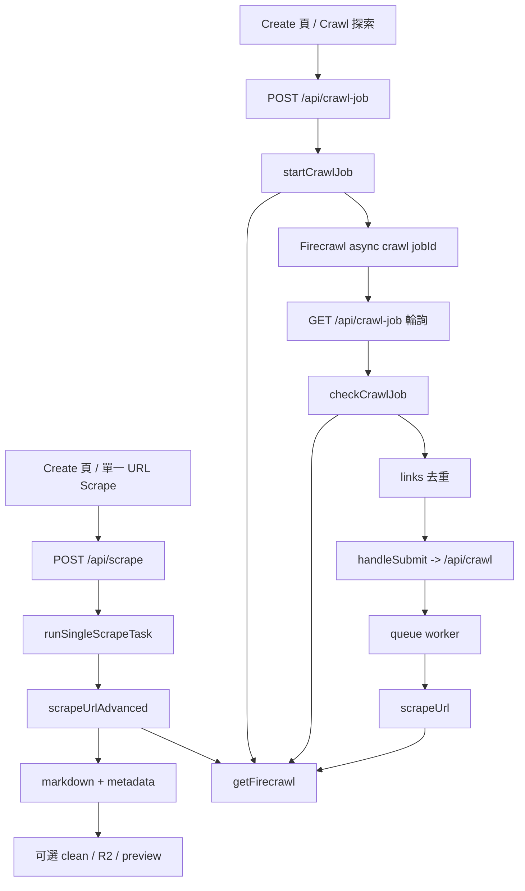

# Firecrawl wrapper：scrape、advanced scrape 與 async crawl

本頁聚焦 `lib/services/crawler.ts` 這層 Firecrawl SDK 包裝，以及它如何被三條不同流程共用：批次 queue worker 用 `scrapeUrl()` 抓單頁內容、單頁預覽用 `scrapeUrlAdvanced()` 帶進階參數、網站探索用 `startCrawlJob()` / `checkCrawlJob()` 啟動與輪詢 async crawl。若你要判斷「某個 Firecrawl 請求為何長這樣」或「哪裡只是找連結、哪裡才真正抓內容」，這一頁就是對照表。Sources: [lib/services/crawler.ts](lib/services/crawler.ts#L13-L151), [app/api/scrape/route.ts](app/api/scrape/route.ts#L8-L46), [app/api/crawl-job/route.ts](app/api/crawl-job/route.ts#L4-L75), [lib/services/crawl-dispatch.ts](lib/services/crawl-dispatch.ts#L165-L224)

## 核心流程

Sources: [app/page.tsx](app/page.tsx#L566-L606), [app/page.tsx](app/page.tsx#L675-L827), [app/api/scrape/route.ts](app/api/scrape/route.ts#L8-L46), [app/api/crawl-job/route.ts](app/api/crawl-job/route.ts#L4-L75), [lib/services/scrape-task.ts](lib/services/scrape-task.ts#L155-L241), [lib/services/crawler.ts](lib/services/crawler.ts#L13-L151), [lib/services/crawl-dispatch.ts](lib/services/crawl-dispatch.ts#L165-L224)

`lib/services/crawler.ts` 是 repo 內唯一直接 new `FirecrawlApp` 的地方；`getFirecrawl()` 會先取 override 的 `apiKey` / `apiUrl`，否則退回 `config.firecrawl`，再用 `apiKey-apiUrl` 組成 signature 做 singleton 快取，只有在 key 或 URL 改變時才重建 client。值得注意的是，當 override 與 `FIRECRAWL_API_KEY` 都缺席時，這層仍會用 `'DUMMY_KEY'` 建 client，表示「是否真的有可用金鑰」不是在 wrapper 初始化階段阻擋，而是留給後續實際 API 呼叫暴露。Sources: [lib/services/crawler.ts](lib/services/crawler.ts#L10-L28), [lib/config.ts](lib/config.ts#L1-L5)

## 關鍵函式 / 呼叫者對照

| 包裝函式 | Firecrawl SDK 呼叫 | 主要上游 | 主要輸出 / 用途 |
|---|---|---|---|
| `getFirecrawl()` | `new FirecrawlApp(...)` | `scrapeUrl`、`scrapeUrlAdvanced`、`startCrawlJob`、`checkCrawlJob` | 依 `apiKey + apiUrl` 重用或重建 client。 |
| `scrapeUrl()` | `firecrawl.scrapeUrl(url, { formats: ['markdown'], timeout: 60000 })` | `processCrawlJob()` | 給批次 queue worker 的單頁 markdown 抓取。 |
| `scrapeUrlAdvanced()` | `firecrawl.scrapeUrl(url, scrapeParams)` | `runSingleScrapeTask()` / `/api/scrape` | 帶 `waitFor`、`timeout`、`onlyMainContent`、tag 篩選等進階參數，回傳 `markdown + metadata`。 |
| `startCrawlJob()` | `firecrawl.asyncCrawlUrl(url, { limit, scrapeOptions: { formats: ['links'] } })` | `/api/crawl-job` `POST` | 啟動非同步探索，只拿 job id，不直接抓頁面正文。 |
| `checkCrawlJob()` | `firecrawl.checkCrawlStatus(jobId)` | `/api/crawl-job` `GET` | 讀 async crawl 狀態；route 完成後再抽出並去重 links。 |

Sources: [lib/services/crawler.ts](lib/services/crawler.ts#L13-L151), [lib/services/scrape-task.ts](lib/services/scrape-task.ts#L155-L241), [app/api/scrape/route.ts](app/api/scrape/route.ts#L8-L46), [app/api/crawl-job/route.ts](app/api/crawl-job/route.ts#L4-L75), [lib/services/crawl-dispatch.ts](lib/services/crawl-dispatch.ts#L165-L224)

## 基礎 scrape：給 queue worker 的最小抓取面

`scrapeUrl()` 很刻意地把 Firecrawl 請求縮到最小：固定 `formats: ['markdown']`，並把 Firecrawl 端 timeout 寫死成 60 秒。真正使用這條函式的是 `processCrawlJob()`，它先從 `engineSettings` 撈 `firecrawlKey` / `firecrawlUrl` 組成 crawlerConfig，再把整段處理包進 `withTimeout()`；也就是說，批次 crawl URL 的實際行為是「外層工作逾時（預設 300 秒） + 內層 Firecrawl 請求逾時（60 秒）」雙層限制，完成後才把 raw / cleaned markdown 寫入 R2 並更新 task 狀態。Sources: [lib/services/crawler.ts](lib/services/crawler.ts#L31-L53), [lib/services/crawl-dispatch.ts](lib/services/crawl-dispatch.ts#L165-L218), [lib/utils/helpers.ts](lib/utils/helpers.ts#L21-L44)

這代表批次工作刻意不暴露 advanced scrape 的頁面級選項：沒有 `waitFor`、沒有 `onlyMainContent`、沒有 tag include/exclude，因為 queue worker 的責任是穩定地把每個 URL 變成 markdown 並落盤，而不是做互動式內容預覽調校。Sources: [lib/services/crawler.ts](lib/services/crawler.ts#L34-L43), [lib/services/crawl-dispatch.ts](lib/services/crawl-dispatch.ts#L175-L204)

## advanced scrape：單頁預覽與可選 metadata

單頁路徑從前端 `handleScrape()` 開始：只有輸入被判定為「單一 URL」時才會 POST `/api/scrape`；送出的欄位除了 `url` 與 `firecrawlKey`，還包含 `waitFor`、`timeout`、`onlyMainContent`、`mobile`、`includeTags`、`excludeTags`、`saveToR2`、`enableClean` 與 LLM / R2 參數。route 自己只檢查 `url` 是否存在且為字串，之後完全委派給 `runSingleScrapeTask()`。Sources: [app/page.tsx](app/page.tsx#L675-L756), [app/page.tsx](app/page.tsx#L1173-L1265), [app/api/scrape/route.ts](app/api/scrape/route.ts#L8-L46)

`runSingleScrapeTask()` 會先把字串型 `waitFor` / `timeout` 解析成數字、把 tag 字串拆成陣列，再呼叫 `scrapeUrlAdvanced()`；wrapper 端則永遠保留 `formats: ['markdown']`，只把有值的進階欄位加進 `scrapeParams`，成功後回傳 `markdown` 與可選 `metadata`。前端成功收到結果後，會把 `metadata` 存進 `scrapeResult`，並在預覽面板把 `metadata.statusCode` 當成狀態碼顯示，同時允許使用者在 raw / cleaned 內容之間切換。Sources: [lib/services/scrape-task.ts](lib/services/scrape-task.ts#L71-L133), [lib/services/scrape-task.ts](lib/services/scrape-task.ts#L155-L220), [lib/services/crawler.ts](lib/services/crawler.ts#L55-L108), [app/page.tsx](app/page.tsx#L739-L746), [app/page.tsx](app/page.tsx#L1490-L1549)

一個容易忽略的細節是：UI 雖然把 advanced timeout 輸入框 placeholder 寫成 `30000`，但 state 預設其實是空字串；`parseOptionalNumber()` 對空字串會回傳 `undefined`，而 `scrapeUrlAdvanced()` 只在 `options.timeout !== undefined` 時才把 timeout 帶進 Firecrawl。所以使用者若不手動輸入值，advanced path 並沒有內建 30 秒 timeout。另一個邊界是單頁 service 的 `crawlerOverrides` 只填 `apiKey`，沒有 `apiUrl`，代表這條公開單頁預覽路徑支援換 key，但不支援換 Firecrawl endpoint。Sources: [app/page.tsx](app/page.tsx#L127-L136), [app/page.tsx](app/page.tsx#L1179-L1200), [lib/services/scrape-task.ts](lib/services/scrape-task.ts#L71-L78), [lib/services/scrape-task.ts](lib/services/scrape-task.ts#L155-L166), [lib/services/crawler.ts](lib/services/crawler.ts#L74-L95)

## async crawl：只做探索，不做正文抓取

`startCrawlJob()` 不是抓內容，而是對 Firecrawl 送 `asyncCrawlUrl()`，參數只有 `limit` 與 `scrapeOptions.formats: ['links']`；成功後只要求回傳 job id。`checkCrawlJob()` 也只是檢查 status response 是否成功，然後把原始狀態物件往上交給 route，因此 async crawl 這層的職責被明確限制在「探索站點並回報 links」。Sources: [lib/services/crawler.ts](lib/services/crawler.ts#L110-L150)

`/api/crawl-job` `POST` 會接 `url`、`limit`、`engineSettings.firecrawlApiKey`、`engineSettings.firecrawlApiUrl` 並回傳 `jobId`；`GET` 則讀 `jobId` 與可選 `apiKey`，在狀態完成後從 `statusResult.data` 中抽 `item.metadata?.sourceURL || item.url`，再用 `Set` 去重後回傳 `links`。前端 `handleCrawl()` 會每 4 秒輪詢一次，拿到 links 後組成換行字串，再交給 `handleSubmit()` POST `/api/crawl` 進入正式批次任務。Sources: [app/api/crawl-job/route.ts](app/api/crawl-job/route.ts#L4-L75), [app/page.tsx](app/page.tsx#L566-L606), [app/page.tsx](app/page.tsx#L758-L827)

因此 async crawl 和後續內容抓取是兩段式設計：第一段只把站內頁面清單找出來，第二段才由 batch task / queue worker 逐頁呼叫基礎 `scrapeUrl()` 寫入 raw 與 cleaned 檔。這也是為什麼 `startCrawlJob()` 只要求 `links` 格式，而真正的 markdown 持久化邏輯完全不在 `lib/services/crawler.ts` 的 crawl API 分支，而是在 `processCrawlJob()`。Sources: [lib/services/crawler.ts](lib/services/crawler.ts#L113-L135), [lib/services/crawl-dispatch.ts](lib/services/crawl-dispatch.ts#L165-L204)

## 呼叫邊界與目前可見坑點

目前 Create 頁只維護 `firecrawlKey` 這個前端狀態；不論是單頁 `handleScrape()`、batch `handleSubmit()`，還是 crawl preflight `handleCrawl()` 與後續 poll，都只把 key 往後送。相對地，wrapper 本身與 queue worker 其實都能吃 `apiUrl` / `firecrawlUrl` 覆寫，而 `/api/crawl-job` `POST` 也接受 `firecrawlApiUrl`；這使得「自訂 Firecrawl base URL」成為一條後端具備能力、但預設 UI 並未完整打通的路徑。Sources: [app/page.tsx](app/page.tsx#L96-L107), [app/page.tsx](app/page.tsx#L578-L600), [app/page.tsx](app/page.tsx#L770-L797), [app/api/crawl-job/route.ts](app/api/crawl-job/route.ts#L13-L23), [lib/services/crawler.ts](lib/services/crawler.ts#L13-L28), [lib/services/crawl-dispatch.ts](lib/services/crawl-dispatch.ts#L177-L183)

另一個實務上的差異是輪詢端：`/api/crawl-job` `GET` 只接受 `apiKey` 查詢參數，沒有對應的 `apiUrl`；所以如果未來有人從後端或外部客戶端以非預設 endpoint 啟動 crawl-job，現有前端輪詢程式碼沒有同等的 endpoint 覆寫欄位可以帶回去。這不是 wrapper 本身的限制，而是 route / UI 介面層目前暴露能力較少。Sources: [app/api/crawl-job/route.ts](app/api/crawl-job/route.ts#L34-L49), [app/page.tsx](app/page.tsx#L791-L799), [lib/services/crawler.ts](lib/services/crawler.ts#L141-L150)

## 已有測試證據與仍需人工留意處

本頁已讀到的自動化證據集中在 `tests/scrape-task.test.ts`：它透過依賴注入 stub 掉 `scrapeUrlAdvanced()`，驗證單頁成功案例一定會寫出 `processing -> completed` 兩筆 task 狀態並回傳 markdown / metadata，失敗案例則會走 `processing -> failed` 並保留錯誤字串。這些測試能穩住 advanced scrape 的 service 契約，但它們保護的是 `runSingleScrapeTask()` 的生命週期，不是 Firecrawl wrapper singleton、async crawl 輪詢或 endpoint override 本身。Sources: [lib/services/scrape-task.ts](lib/services/scrape-task.ts#L51-L69), [tests/scrape-task.test.ts](tests/scrape-task.test.ts#L6-L156), [lib/services/crawler.ts](lib/services/crawler.ts#L13-L151), [app/api/crawl-job/route.ts](app/api/crawl-job/route.ts#L4-L75)

因此，如果你要修改 `lib/services/crawler.ts`，最值得補強的不是單頁任務狀態轉換，而是三類未被這份測試直接證實的風險：client singleton 是否在跨 key / URL 切換時正確重建、async crawl 的 `statusResult.data` 形狀是否永遠符合 route 的 link 抽取邏輯，以及 route / UI 對 `apiUrl` 覆寫能力是否會與底層 wrapper 支援度繼續脫節。這些點目前都能從實作碼看出意圖，但仍需要額外測試或整合驗證才能把風險降到和 single-scrape service 同級。Sources: [lib/services/crawler.ts](lib/services/crawler.ts#L10-L28), [lib/services/crawler.ts](lib/services/crawler.ts#L110-L150), [app/api/crawl-job/route.ts](app/api/crawl-job/route.ts#L50-L67), [tests/scrape-task.test.ts](tests/scrape-task.test.ts#L6-L156)
